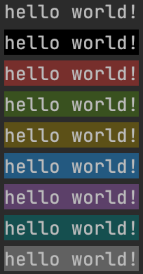

### Shell脚本编写

#### 一、执行curl下载的脚本
##### 1、直接执行
```bash
bash <(curl -s 'http://demo.sh')
```
##### 2、携带参数
shell脚本内通过$1,$2...获取入参。
```bash
curl -s 'http://demo.sh' | bash -s arg1 arg2
```
#### 二、读取文件内容/变量

```bash
#!/bin/bash
lines=$(grep -r "keyword" . --include="*.txt" -n)
if [ "$lines" == "" ]; then
  echo "Not Found"
  exit
fi

while IFS="\n" read -r line; do
  echo $line
  # process line
done <<<"$lines"
```

#### 三、正则匹配

```bash
if [[ "hello world" =~ (he..o).*(world) ]]; then
    echo "Matched"
fi

# 匹配group获取
firstGroup=${BASH_REMATCH[1]} # hello
secondGroup=${BASH_REMATCH[2]} # world

# 字符串替换
replaceOnce=${BASH_REMATCH[1]/l/o} # heolo
replaceAll=${BASH_REMATCH[1]//l/o} # heooo
```

#### 四、Echo着色输出

> 着色工具：https://ansi.gabebanks.net/

```bash
# 首: \033[xxx;xxxm - 指定显示属性 
# 尾: \033[0m - 关闭所有属性
# echo -e "\033[字背景颜色;文字颜色m字符串\033[0m"

echo -e "\033[49mhello world!\033[0m"
echo -e "\033[40mhello world!\033[0m"
echo -e "\033[41mhello world!\033[0m"
echo -e "\033[42mhello world!\033[0m"
echo -e "\033[43mhello world!\033[0m"
echo -e "\033[44mhello world!\033[0m"
echo -e "\033[45mhello world!\033[0m"
echo -e "\033[46mhello world!\033[0m"
echo -e "\033[47mhello world!\033[0m"
```



| 颜色      | 背景色 | 前景色 |
| ------- | --- |:---:|
| Default | 49  | 39  |
| Black   | 40  | 30  |
| Red     | 41  | 31  |
| Green   | 42  | 32  |
| Yellow  | 43  | 33  |
| Blue    | 44  | 34  |
| Magenta | 45  | 35  |
| Cyan    | 46  | 36  |
| White   | 47  | 37  |

#### 五、判断上一条命令执行是否异常

```bash
function exit_if_error() {
  if [ $? -eq 1 ]; then
    echo -e "\033[41;33mError Happens\033[0m"
    exit 1;
  fi
}
```


