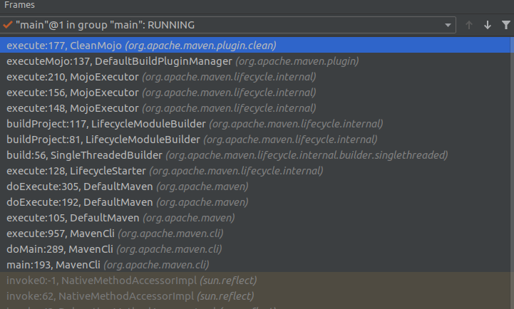
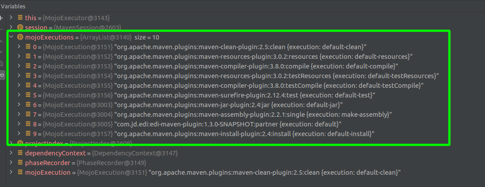

### 一、maven源码调试

1）查看本机Maven版本

```bash
$ mvn -v

Apache Maven 3.6.3
Maven home: /usr/share/maven
Java version: 1.8.0_292, vendor: Private Build, runtime: /usr/lib/jvm/java-8-openjdk-amd64/jre
Default locale: en_US, platform encoding: UTF-8
OS name: "linux", version: "5.4.0-84-generic", arch: "amd64", family: "unix"
```

2）准备maven源码

```bash
# 克隆Maven源码到本地
$ git clone git@github.com:apache/maven.git

# 迁出对应版本代码
$ git checkout maven-3.6.3

# 编译源码
$ mvn clean install -Dmaven.test.skip=true -Drat.ignoreErrors=true
```

3）在任意地方通过mvnDebug执行，然后其会阻塞等待链接

```bash
$ mvnDebug clean install -f pom.xml

Preparing to execute Maven in debug mode
Listening for transport dt_socket at address: 8000
```

4）Maven源码中通过*Remote JVM Debug*进行调试

### 二、maven启动流程



#### 1. MavenCli#main

maven使用Plexus容器（一种IOC容器）进行MOJO等管理，*apache-maven/src/bin/m2.conf*里声明了其主类org.apache.maven.cli.MavenCli：

```ini
main is org.apache.maven.cli.MavenCli from plexus.core

set maven.conf default ${maven.home}/conf

[plexus.core]
load       ${maven.conf}/logging
optionally ${maven.home}/lib/ext/*.jar
load       ${maven.home}/lib/*.jar
```


```java
public int doMain( CliRequest cliRequest )
    initialize( cliRequest );

    // 解析输入的命令
    cli( cliRequest );

    // 获取系统配置
    properties( cliRequest );
    logging( cliRequest );
    version( cliRequest );
    
    // 初始化Plexus容器
    PlexusContainer localContainer = container( cliRequest );
    commands( cliRequest );
    configure( cliRequest );
    toolchains( cliRequest );
    populateRequest( cliRequest );
    encryption( cliRequest );
    repository( cliRequest );

    // 执行
    return execute( cliRequest );      
}
```

#### 2. DefaultMaven#execute

#### 3. LifecycleStarter#execute

#### 4. SingleThreadedBuilder#build

#### 5. LifecycleModuleBuilder#buildProject

```java
// 构建执行计划
MavenExecutionPlan executionPlan = builderCommon.resolveBuildPlan( session, currentProject, taskSegment, new HashSet<Artifact>() );

// 获取执行计划中要执行的MOJO
List<MojoExecution> mojoExecutions = executionPlan.getMojoExecutions();

// 执行MOJO
mojoExecutor.execute( session, mojoExecutions, reactorContext.getProjectIndex());
```

构建执行计划时会根据输入的maven命令和Maven的phase集，计算出本次命令需要执行的所有phase及phase绑定的MOJO（关键方法：*DefaultLifecycleExecutionPlanCalculator#calculateMojoExecutions*）。

#### 6.MojoExecutor#execute

MojoExecutor接收到的mojoExecutions内容如下：



#### 7.DefaultBuildPluginManager#executeMojo

插件管理获取对应MOJO执行

#### 8. Mojo#execute

执行Mojo的具体逻辑

### 附录：maven所有phase

* 文件：*maven-core/src/main/resources/META-INF/plexus/components.xml*。

* 类：DefaultLifecycleExecutionPlanCalculator.defaultLifeCycles属性

```xml
<?xml version="1.0" encoding="UTF-8"?>

<!--
Licensed to the Apache Software Foundation (ASF) under one
or more contributor license agreements.  See the NOTICE file
distributed with this work for additional information
regarding copyright ownership.  The ASF licenses this file
to you under the Apache License, Version 2.0 (the
"License"); you may not use this file except in compliance
with the License.  You may obtain a copy of the License at

    http://www.apache.org/licenses/LICENSE-2.0

Unless required by applicable law or agreed to in writing,
software distributed under the License is distributed on an
"AS IS" BASIS, WITHOUT WARRANTIES OR CONDITIONS OF ANY
KIND, either express or implied.  See the License for the
specific language governing permissions and limitations
under the License.
-->

<!--
  There is currently only one component descriptor that cannot be generated from annotations because of the
  accompanying configuration. Our options are to embed this information programatically or use a configuration source
  to pull in the lifecycle information.
-->
<component-set>
  <components>
    <!-- 'default' lifecycle, without any binding since it is dependent on packaging -->
    <component>
      <role>org.apache.maven.lifecycle.Lifecycle</role>
      <implementation>org.apache.maven.lifecycle.Lifecycle</implementation>
      <role-hint>default</role-hint>
      <configuration>
        <id>default</id>
        <!-- START SNIPPET: lifecycle -->
        <phases>
          <phase>validate</phase>
          <phase>initialize</phase>
          <phase>generate-sources</phase>
          <phase>process-sources</phase>
          <phase>generate-resources</phase>
          <phase>process-resources</phase>
          <phase>compile</phase>
          <phase>process-classes</phase>
          <phase>generate-test-sources</phase>
          <phase>process-test-sources</phase>
          <phase>generate-test-resources</phase>
          <phase>process-test-resources</phase>
          <phase>test-compile</phase>
          <phase>process-test-classes</phase>
          <phase>test</phase>
          <phase>prepare-package</phase>
          <phase>package</phase>
          <phase>pre-integration-test</phase>
          <phase>integration-test</phase>
          <phase>post-integration-test</phase>
          <phase>verify</phase>
          <phase>install</phase>
          <phase>deploy</phase>
        </phases>
        <!-- END SNIPPET: lifecycle -->
      </configuration>
    </component>

    <!-- 'clean' lifecycle, with default binding -->
    <component>
      <role>org.apache.maven.lifecycle.Lifecycle</role>
      <implementation>org.apache.maven.lifecycle.Lifecycle</implementation>
      <role-hint>clean</role-hint>
      <configuration>
        <id>clean</id>
        <!-- START SNIPPET: clean -->
        <phases>
          <phase>pre-clean</phase>
          <phase>clean</phase>
          <phase>post-clean</phase>
        </phases>
        <default-phases>
          <clean>
            org.apache.maven.plugins:maven-clean-plugin:2.5:clean
          </clean>
        </default-phases>
        <!-- END SNIPPET: clean -->
      </configuration>
    </component>

    <!-- 'site' lifecycle, with default bindings -->
    <component>
      <role>org.apache.maven.lifecycle.Lifecycle</role>
      <implementation>org.apache.maven.lifecycle.Lifecycle</implementation>
      <role-hint>site</role-hint>
      <configuration>
        <id>site</id>
        <!-- START SNIPPET: site -->
        <phases>
          <phase>pre-site</phase>
          <phase>site</phase>
          <phase>post-site</phase>
          <phase>site-deploy</phase>
        </phases>
        <default-phases>
          <site>
            org.apache.maven.plugins:maven-site-plugin:3.3:site
          </site>
          <site-deploy>
            org.apache.maven.plugins:maven-site-plugin:3.3:deploy
          </site-deploy>
        </default-phases>
        <!-- END SNIPPET: site -->
      </configuration>
    </component>

    <component>
      <role>org.sonatype.plexus.components.sec.dispatcher.SecDispatcher</role>
      <role-hint>maven</role-hint>
      <implementation>org.sonatype.plexus.components.sec.dispatcher.DefaultSecDispatcher</implementation>
      <description>Maven Security dispatcher</description>
      <requirements>
        <requirement>
          <role>org.sonatype.plexus.components.cipher.PlexusCipher</role>
          <field-name>_cipher</field-name>
        </requirement>
        <requirement>
          <role>org.sonatype.plexus.components.sec.dispatcher.PasswordDecryptor</role>
          <field-name>_decryptors</field-name>
        </requirement>
      </requirements>
      <configuration>
        <_configuration-file>~/.m2/settings-security.xml</_configuration-file>
      </configuration>
    </component>
  </components>
</component-set>
```