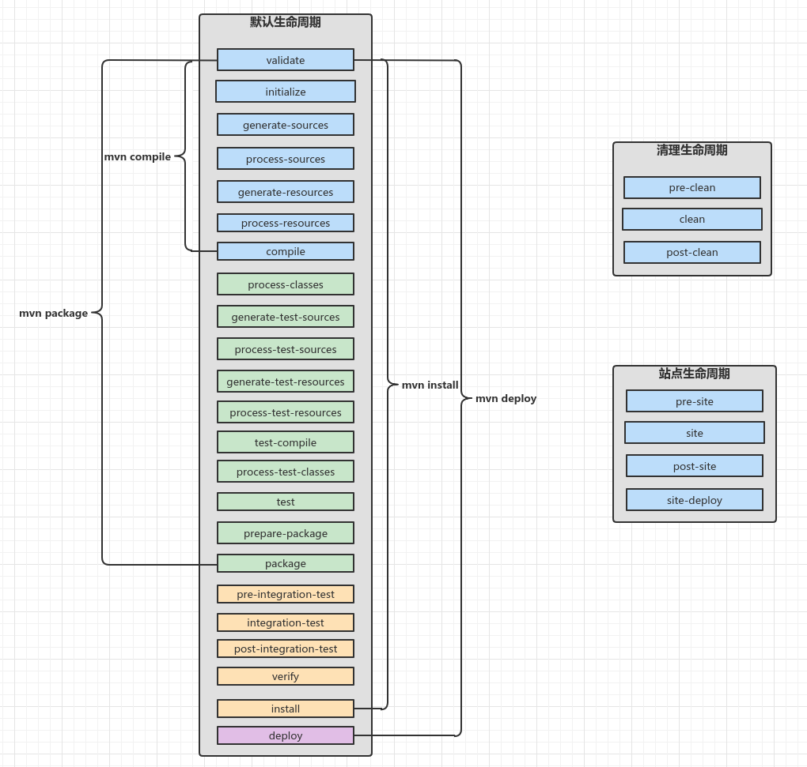
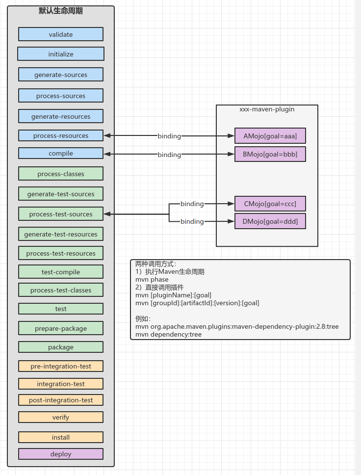

#### 一、插件命名

> You will typically name your plugin `<yourplugin>-maven-plugin`.
>
> Calling it `maven-<yourplugin>-plugin` (note "Maven" is at the beginning of the plugin name) is **strongly discouraged** since it's a **reserved naming pattern for official Apache Maven plugins maintained by the Apache Maven team** with groupId `org.apache.maven.plugins`. Using this naming pattern is an infringement of the Apache Maven Trademark.

其中**yourplugin**是你的插件名，可以通过`mvn yourplugin:goal`调用指定MOJO。

#### 二、Maven生命周期和MOJO

##### 1）Maven三个独立生命周期

参考：[官网-maven生命周期](https://maven.apache.org/ref/3.8.4/maven-core/lifecycles.html)



##### 2）Maven生命周期和插件绑定关系

参考：[官网-Maven常用插件的默认绑定](https://maven.apache.org/ref/3.8.4/maven-core/default-bindings.html)



#### 三、MOJO执行的两个方式

##### 1）执行Maven生命周期

```bash
$ mvn phase
```

##### 2）直接调用插件

语法格式：

```bash
# 完全限定名:goal
$ mvn [groupId]:[artifactId]:[version]:[goal]
# 插件名:goal
$ mvn [pluginName]:[goal]
```

示例：

```bash
$ mvn org.apache.maven.plugins:maven-dependency-plugin:2.8:tree
$ mvn dependency:tree
```

#### 附录：MAVEN所有phase

* 文件：*maven-core/src/main/resources/META-INF/plexus/components.xml*。
* 类：DefaultLifecycleExecutionPlanCalculator.defaultLifeCycles属性

```xml
<?xml version="1.0" encoding="UTF-8"?>

<!--
Licensed to the Apache Software Foundation (ASF) under one
or more contributor license agreements.  See the NOTICE file
distributed with this work for additional information
regarding copyright ownership.  The ASF licenses this file
to you under the Apache License, Version 2.0 (the
"License"); you may not use this file except in compliance
with the License.  You may obtain a copy of the License at

    http://www.apache.org/licenses/LICENSE-2.0

Unless required by applicable law or agreed to in writing,
software distributed under the License is distributed on an
"AS IS" BASIS, WITHOUT WARRANTIES OR CONDITIONS OF ANY
KIND, either express or implied.  See the License for the
specific language governing permissions and limitations
under the License.
-->

<!--
  There is currently only one component descriptor that cannot be generated from annotations because of the
  accompanying configuration. Our options are to embed this information programatically or use a configuration source
  to pull in the lifecycle information.
-->
<component-set>
  <components>
    <!-- 'default' lifecycle, without any binding since it is dependent on packaging -->
    <component>
      <role>org.apache.maven.lifecycle.Lifecycle</role>
      <implementation>org.apache.maven.lifecycle.Lifecycle</implementation>
      <role-hint>default</role-hint>
      <configuration>
        <id>default</id>
        <!-- START SNIPPET: lifecycle -->
        <phases>
          <phase>validate</phase>
          <phase>initialize</phase>
          <phase>generate-sources</phase>
          <phase>process-sources</phase>
          <phase>generate-resources</phase>
          <phase>process-resources</phase>
          <phase>compile</phase>
          <phase>process-classes</phase>
          <phase>generate-test-sources</phase>
          <phase>process-test-sources</phase>
          <phase>generate-test-resources</phase>
          <phase>process-test-resources</phase>
          <phase>test-compile</phase>
          <phase>process-test-classes</phase>
          <phase>test</phase>
          <phase>prepare-package</phase>
          <phase>package</phase>
          <phase>pre-integration-test</phase>
          <phase>integration-test</phase>
          <phase>post-integration-test</phase>
          <phase>verify</phase>
          <phase>install</phase>
          <phase>deploy</phase>
        </phases>
        <!-- END SNIPPET: lifecycle -->
      </configuration>
    </component>

    <!-- 'clean' lifecycle, with default binding -->
    <component>
      <role>org.apache.maven.lifecycle.Lifecycle</role>
      <implementation>org.apache.maven.lifecycle.Lifecycle</implementation>
      <role-hint>clean</role-hint>
      <configuration>
        <id>clean</id>
        <!-- START SNIPPET: clean -->
        <phases>
          <phase>pre-clean</phase>
          <phase>clean</phase>
          <phase>post-clean</phase>
        </phases>
        <default-phases>
          <clean>
            org.apache.maven.plugins:maven-clean-plugin:2.5:clean
          </clean>
        </default-phases>
        <!-- END SNIPPET: clean -->
      </configuration>
    </component>

    <!-- 'site' lifecycle, with default bindings -->
    <component>
      <role>org.apache.maven.lifecycle.Lifecycle</role>
      <implementation>org.apache.maven.lifecycle.Lifecycle</implementation>
      <role-hint>site</role-hint>
      <configuration>
        <id>site</id>
        <!-- START SNIPPET: site -->
        <phases>
          <phase>pre-site</phase>
          <phase>site</phase>
          <phase>post-site</phase>
          <phase>site-deploy</phase>
        </phases>
        <default-phases>
          <site>
            org.apache.maven.plugins:maven-site-plugin:3.3:site
          </site>
          <site-deploy>
            org.apache.maven.plugins:maven-site-plugin:3.3:deploy
          </site-deploy>
        </default-phases>
        <!-- END SNIPPET: site -->
      </configuration>
    </component>

    <component>
      <role>org.sonatype.plexus.components.sec.dispatcher.SecDispatcher</role>
      <role-hint>maven</role-hint>
      <implementation>org.sonatype.plexus.components.sec.dispatcher.DefaultSecDispatcher</implementation>
      <description>Maven Security dispatcher</description>
      <requirements>
        <requirement>
          <role>org.sonatype.plexus.components.cipher.PlexusCipher</role>
          <field-name>_cipher</field-name>
        </requirement>
        <requirement>
          <role>org.sonatype.plexus.components.sec.dispatcher.PasswordDecryptor</role>
          <field-name>_decryptors</field-name>
        </requirement>
      </requirements>
      <configuration>
        <_configuration-file>~/.m2/settings-security.xml</_configuration-file>
      </configuration>
    </component>
  </components>
</component-set>
```


#### # 参考

1. [Maven插件命名规范](https://maven.apache.org/guides/plugin/guide-java-plugin-development.html)
2. [Maven生命周期和构建原理](https://blog.csdn.net/luanlouis/article/details/50492163)