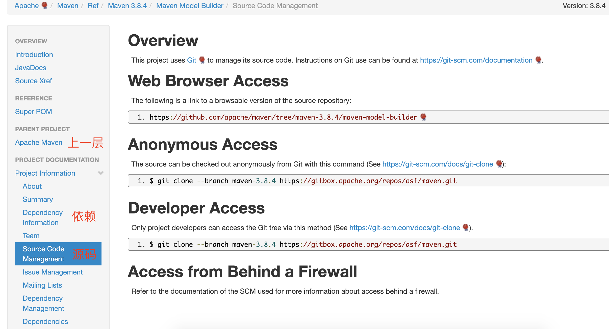

#### 一、Maven源码结构

> https://maven.apache.org/ref/3.8.4/index.html
>
> **箭头表示模块的依赖关系，箭尾模块依赖箭头模块。**

#### 二、主要模块说明

| 模块                | 说明                               | 所在仓库                                 | 目录                      |
| ------------------- | ---------------------------------- | ---------------------------------------- | ------------------------- |
| model               | Maven的POM模型类                   | https://github.com/apache/maven          | maven-model               |
| artifact            | Maven构件接口和实现                | https://github.com/apache/maven          | maven-artifact            |
| repository-metadata | Maven仓库模型                      | https://github.com/apache/maven          | maven-repository-metadata |
| builder-support     | model/setting/toolchains构造器描述 | https://github.com/apache/maven          | maven-builder-support     |
| module-builder      | Maven effective model构造器        | https://github.com/apache/maven          | maven-model-builder       |
| resolver            | 根据给定仓库进行依赖解析           | https://github.com/apache/maven-resolver | maven-resolver-1.7.3      |
| resolver-provider   | resolver扩展，绑定local和远程仓库  | https://github.com/apache/maven          | maven-resolver-provider   |
| plugin-api          | 插件API，由MOJO实现的goal组成      | https://github.com/apache/maven          | maven-plugin-api          |
| core                | maven核心，管理整个构建过程        | https://github.com/apache/maven          | maven-core                |

#### 附录、官网的模块信息

第一幅图点击对应模块热点区域后，会跳转至响应文档，如点击`model-builder`后跳转至*https://maven.apache.org/ref/3.8.4/maven-model-builder/*。

如下图，可以从**Source Code Management**中找到其所在GitHub仓库地址：*https://github.com/apache/maven/tree/maven-3.8.4/maven-model-builder*，然后就可以进行源码下载和调试了。

