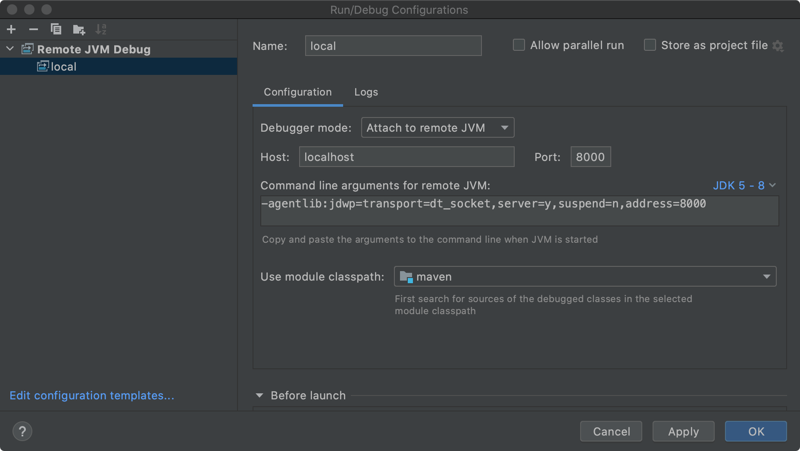

### MAVEN源码调试

---

#### 1. 查看本机Maven版本

```bash
$ mvn -v

Apache Maven 3.6.3
Maven home: /usr/share/maven
Java version: 1.8.0_292, vendor: Private Build, runtime: /usr/lib/jvm/java-8-openjdk-amd64/jre
Default locale: en_US, platform encoding: UTF-8
OS name: "linux", version: "5.4.0-84-generic", arch: "amd64", family: "unix"
```

#### 2. 准备maven源码

```bash
# 克隆Maven源码到本地
$ git clone git@github.com:apache/maven.git

# 迁出对应版本代码
$ git checkout maven-3.6.3

# 编译源码
$ mvn clean install -Dmaven.test.skip=true -Drat.ignoreErrors=true
```

#### 3. 用mvnDebug执行，其会阻塞等待链接

```bash
$ mvnDebug clean install -f pom.xml

Preparing to execute Maven in debug mode
Listening for transport dt_socket at address: 8000
```

#### 4. Maven源码中通过*Remote JVM Debug*进行调试



#### # 附录 - 常用源码仓库地址

```url
git@github.com:apache/maven.git
git@github.com:apache/maven-resolver.git
git@github.com:apache/maven-dependency-plugin.git
```

