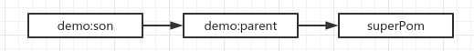
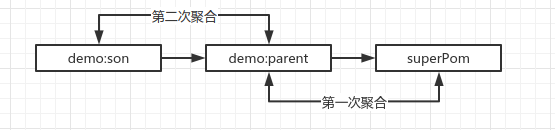
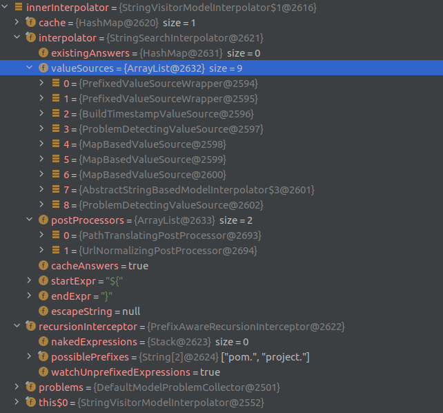
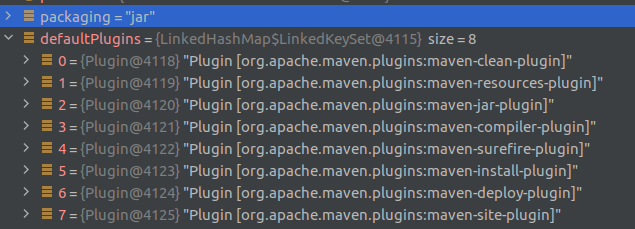
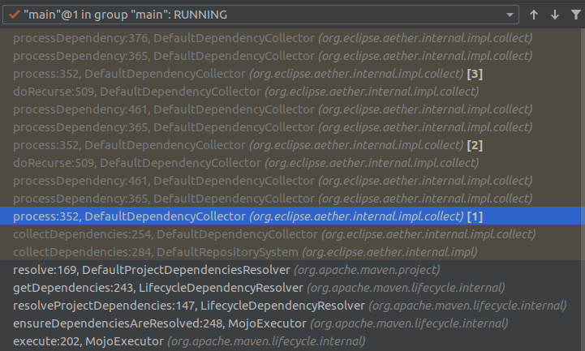
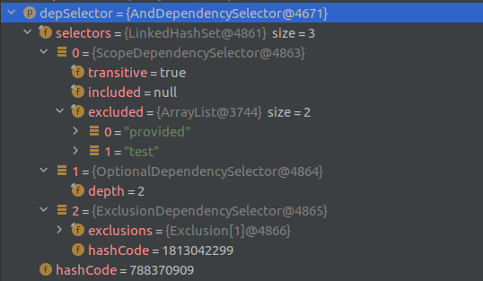
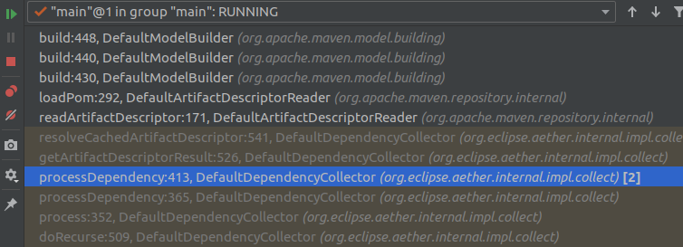
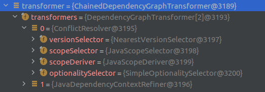

### 一、依赖解析流程说明

1）通过`DefaultModelBuilder#build`生成当前pom的Model，也就是`effective pom`。

2）递归解析（深度遍历）`effective pom`的child dependency，生成`effective pom`。

### 二、生成effective pom

> 参考：https://maven.apache.org/ref/3.8.4/maven-model-builder/
>
> 源码：org.apache.maven.model.building.DefaultModelBuilder#build

#### 阶段1

**1）profile activation**

从命令行指定激活的profile

**2）raw model validation**

当前pom的Raw model校验

**3）model normalization**

当前pom的model规范化，合并重复声明的依赖

**4）profile injection**

把激活态profile（命令行指定激活的或者POM中默认激活的）内容合并注入到model中，如配置、依赖等。

**5）parent resolution until super-pom**

解析当前pom的父POM的model直到SuperPOM。解析完后，lineage内的对象如下。



源码如下：

```java
Collection<String> parentIds = new LinkedHashSet<>(); // 用来判断循环解析
List<ModelData> lineage = new ArrayList<>(); // 用来保存当前pom到super-pom mode的列表
for (ModelData currentData = resultData; currentData != null;) {
    lineage.add(currentData);
    Model rawModel = currentData.getModel();
    currentData.setRawModel(rawModel);
    Model tmpModel = rawModel.clone();
    currentData.setModel(tmpModel);

    // model normalization, 去重
    modelNormalizer.mergeDuplicates( tmpModel, request, problems );
    
    // 当前POM是超级POM时Break
    if (currentData == superData) {
        break;
    }

    configureResolver( request.getModelResolver(), tmpModel, problems );
    ModelData parentData = readParent(tmpModel, currentData.getSource(), request, problems);

    // 使迭代依次向上找父POM，把他们放入lineage集合内
    if ( parentData == null ) {
        currentData = superData;
    } else if ( currentData == resultData ) { // 首次迭代，设置pom的继承属性
        currentData.setGroupId(currentData.getRawModel().getGroupId() == null ? parentData.getGroupId() : currentData.getRawModel().getGroupId());
        currentData.setVersion(currentData.getRawModel().getVersion() == null ? parentData.getVersion() : currentData.getRawModel().getVersion());
        currentData.setArtifactId(currentData.getRawModel().getArtifactId());
        parentIds.add(currentData.getId()); // 入口POM加入parentIds

        currentData = parentData;
    } else if (!parentIds.add( parentData.getId())) { // 判断父POM循环
        throw new RuntimeException("The parents form a cycle");
    } else {
        currentData = parentData;
    }
}
```

**6）inheritance assembly**

当前pom的model继承合并父POM的配置和依赖等内容。遍历lineage对model进行聚合，从后往前聚合，如下图：



参考源码：*org.apache.maven.model.merge.ModelMerger#mergeModel*

```java
protected void mergeModel( Model target, Model source, boolean sourceDominant, Map<Object, Object> context ) {
    mergeModelBase( target, source, sourceDominant, context );

    mergeModel_ChildProjectUrlInheritAppendPath( target, source, sourceDominant, context );
    mergeModel_ModelVersion( target, source, sourceDominant, context );
    mergeModel_Parent( target, source, sourceDominant, context );
    mergeModel_GroupId( target, source, sourceDominant, context );
    mergeModel_ArtifactId( target, source, sourceDominant, context );
    mergeModel_Version( target, source, sourceDominant, context );
    mergeModel_Packaging( target, source, sourceDominant, context );
    mergeModel_Name( target, source, sourceDominant, context );
    mergeModel_Description( target, source, sourceDominant, context );
    mergeModel_Url( target, source, sourceDominant, context );
    mergeModel_InceptionYear( target, source, sourceDominant, context );
    mergeModel_Organization( target, source, sourceDominant, context );
    mergeModel_Licenses( target, source, sourceDominant, context );
    mergeModel_MailingLists( target, source, sourceDominant, context );
    mergeModel_Developers( target, source, sourceDominant, context );
    mergeModel_Contributors( target, source, sourceDominant, context );
    mergeModel_IssueManagement( target, source, sourceDominant, context );
    mergeModel_Scm( target, source, sourceDominant, context );
    mergeModel_CiManagement( target, source, sourceDominant, context );
    mergeModel_Prerequisites( target, source, sourceDominant, context );
    mergeModel_Build( target, source, sourceDominant, context );
    mergeModel_Profiles( target, source, sourceDominant, context );
}

protected void mergeModelBase( ModelBase target, ModelBase source, boolean sourceDominant, Map<Object, Object> context ) {
    mergeModelBase_DistributionManagement( target, source, sourceDominant, context );
    mergeModelBase_Modules( target, source, sourceDominant, context );
    mergeModelBase_Repositories( target, source, sourceDominant, context );
    mergeModelBase_PluginRepositories( target, source, sourceDominant, context );
    mergeModelBase_Dependencies( target, source, sourceDominant, context );
    mergeModelBase_Reporting( target, source, sourceDominant, context );
    mergeModelBase_DependencyManagement( target, source, sourceDominant, context );
    mergeModelBase_Properties( target, source, sourceDominant, context );
}
```

**7）model interpolation**

当前pom的model进行变量解释。变量替换时遵循一定顺序（valueSources内的ValurSource顺序）从配置上下文里找。可参考：[Maven属性替换](./7.Maven属性替换.md)

参考：*org.apache.maven.model.interpolation.StringVisitorModelInterpolator#interpolateModel*



**8）url normallization**

Url规范化，如一些相对目录的替换。

#### 阶段2：可选的插件处理

**1）model path translation**

模型中路径（如main路径、target路径等）解析，替换为当前操作系统的文件分隔符、路径分割。

**2）plugin management injection**

插件约束注入。

**3）(optional) lifecyle bindings injection**

生命周期绑定注入。合并默认插件至model，默认插件通过*lifecycle.getPluginsBoundByDefaultToAllLifecycles( packaging )*获取。



**4）dependency management import**

解析model中*dependencyManagment*中的import依赖，并注入model。如下所示：

```xml
<dependencyManagement>
    <dependencies>
        <!-- 第三方依赖 -->
        <dependency>
            <groupId>person.kivihub</groupId>
            <artifactId>my-bom</artifactId>
            <version>1.0.0-SNAPSHOT</version>
            <type>pom</type>
            <scope>import</scope>
        </dependency>
    <dependencies>
<dependencyManagement>
```

**5）dependency management injection**

根据上一步解析出的依赖版本约束，修改model中依赖的版本。

源码：*org.apache.maven.model.management.DefaultDependencyManagementInjector#injectManagement*

**6）model normalization - inject default values**

给model中的dependency和plugin设置默认的scope — compile。

**7）(optional) report configuration**

**8）(optional) report convesion to decoupled site plugin**

**9）(optional) plugins configuration**

**10）effective model validation**

模型校验，如进行model的groupId，artifactId，version非空校验。

### 三、递归解析子依赖

>  *MojoExecutor*执行Mojo前会调用*org.apache.maven.lifecycle.internal.MojoExecutor#ensureDependenciesAreResolved*进行依赖的递归解析。

**Model是一个多叉数模型，递归解析的过程也是多叉树遍历的过程，Maven再进行解析时通过深度遍历来解析。**



观察上面堆栈，发现递归解析发生时逻辑主要在以下两个方法内：

1）*org.eclipse.aether.internal.impl.collect.DefaultDependencyCollector#processDependency*

2）*org.eclipse.aether.internal.impl.collect.DefaultDependencyCollector#doRecurse*

递归时需要的参数主要有以下内容：

```java
/**
* org.eclipse.aether.internal.impl.collect.DefaultDependencyCollector#process
*/
private void process(final Args args, // 入参，含session（含冲突协调器dependencyGraphTransformer）、trace、 
                    Results results, 
                    List<Dependency> dependencies,    // 本次要遍历的直接依赖
                    List<RemoteRepository> repositories,  // 远程仓库
                    DependencySelector depSelector, // 依赖选择器，如scop选择器、optional选择器、exclude选择器。递归时会向下合并
                    DependencyManager depManager, // 依赖版本管理
                    DependencyTraverser depTraverser,  // 依赖访问者
                    VersionFilter verFilter) {
    for (Dependency dependency : dependencies) {
        processDependency(args, results, repositories, depSelector, depManager, depTraverser, verFilter, dependency);
    }
}
```

#### DefaultDependencyCollector#doRecurse

1）对*depSelector*、*depManager*、*depTraverser*、*verFilter*进行下钻式的合并，即子从父继承合并属性。

2）把当前处理的依赖放入栈：*Args.nodes*，该依赖解析完后弹出。可通过此栈观察当前遍历的路径和深度。

#### DefaultDependencyCollector#processDependency

1）根据`depSelector`对依赖进行判断是否忽略，如*ScopeDependencySelector*、*OptionalDependencySelector*、*ExclusionDependencySelector*。



2）根据`depManager`对依赖进行约束，也就是*<dependencyManagement/>*标签里的内容。

3）根据`depTraverser`判断是否需要递归解析。

4）使用成员属性`descriptorReader`解析当前依赖的*effective pom*。其会调用*ModelBuilder#build*生成*effective pom*，执行两个phase。



5）判断是否是`relocation`，如果是，则进行重定向解析；如果不是，则进行下一步。

6）根据`depTraverser`结果，判断是否进行递归处理。如果需要递归处理则遍历*effective pom*的依赖，调用**DefaultDependencyCollector#doRecurse**方法

### 四、依赖调停

> 递归解析完子依赖后，会获取一个依赖全集。下一步会调用*ChainedDependencyGraphTransformer#transformGraph*对依赖进行调停。

```java
/**
* org.eclipse.aether.internal.impl.collect.DefaultDependencyCollector
*/
public CollectResult collectDependencies(RepositorySystemSession session, CollectRequest request) {

    // ...递归解析部分...

    DependencyGraphTransformer transformer = session.getDependencyGraphTransformer();
    if (transformer != null) {
        try {
            DefaultDependencyGraphTransformationContext context = new DefaultDependencyGraphTransformationContext(session);
            context.put(TransformationContextKeys.STATS, stats);
            result.setRoot(transformer.transformGraph(node, context));
        } catch (RepositoryException e) {
            result.addException(e);
        }
    }
}
```



#### ConflictResolver

> 参考：org.eclipse.aether.util.graph.transformer.ConflictResolver#transformGraph

1）*ConflictIdSorter#transformGraph*计算冲突的依赖，并设置到*context*内。

> org.eclipse.aether.util.graph.transformer.ConflictMarker#analyze

深度遍历依赖树，把依赖按`gourp:artifact:classifier:extension`进行分组。

2）遍历依赖全集，根据上面的分组判断是否冲突；冲突的加入conflictIds。

3）遍历conflictIds，针对每个冲突都深度遍历依赖全集，获取所有冲突的依赖。

4）对冲突的依赖进行调停，依次调用：*VersionSelector*（默认实现NearestVersionSelector）、*ScopeSelector*、*OptionalitySelector*进行依赖调停。

