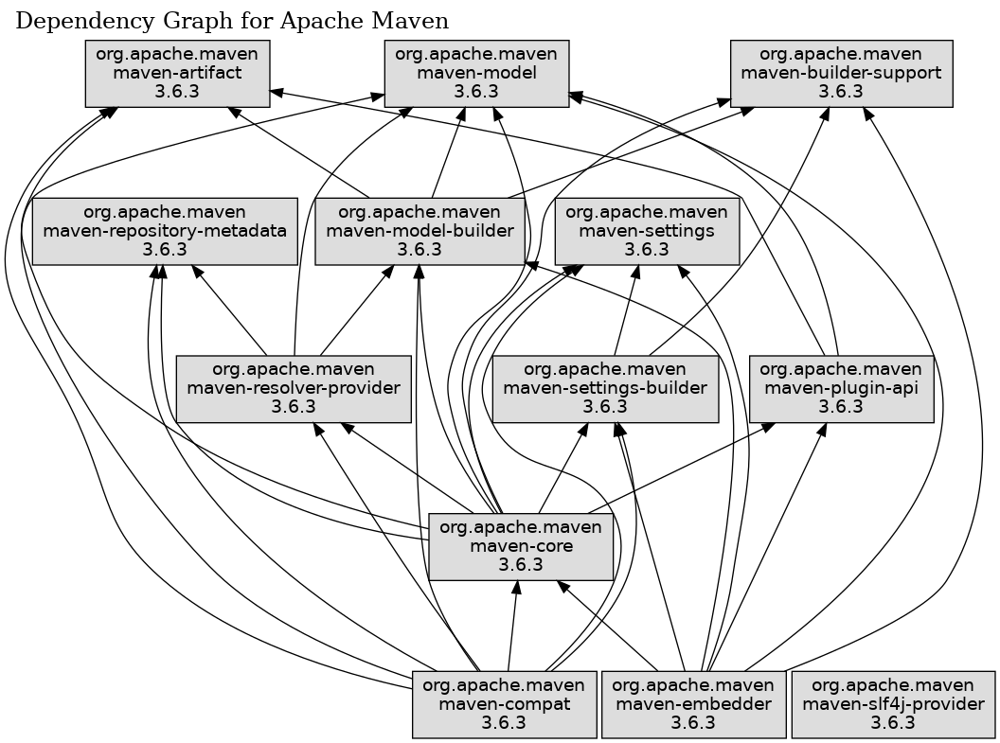

> 当进行模块重构和重组时，需要查看当前模块间的依赖关系。以下说明了两个常用的方式。

## 一、IDEA旗舰版-模块依赖图

> https://www.jetbrains.com/help/idea/project-module-dependencies-diagram.html
>
> 1. From the main menu, select **View | Tool Windows | Project** (Alt+1), select an item (project/module) for which you want to view a diagram.
> 2. Right-click the selected item and from the context menu, select **Diagram | Show Diagram** (or press Ctrl+Alt+Shift+U).
> 3. From the list that opens, select a type of the diagram you want to create.

## 二、maven-graph-plugin

* 源码：https://github.com/fusesource/mvnplugins/tree/master/maven-graph-plugin

* 命令：`mvn org.fusesource.mvnplugins:maven-graph-plugin:1.45:reactor -Dhide-external=true -Dgraph.direction=BT`
* 配置项：参考源码[ProjectMojo.java](https://github.com/fusesource/mvnplugins/blob/master/maven-graph-plugin/src/main/java/org/fusesource/mvnplugins/graph/ProjectMojo.java)

* 示例：*git@github.com:apache/maven.git*根目录执行命令后得到下图：

## 参考：

1. http://site.kuali.org/maven/plugins/graph-maven-plugin/1.0.14/
2. https://github.com/fusesource/mvnplugins/tree/master/maven-graph-plugin
3. https://mvnrepository.com/artifact/org.fusesource.mvnplugins/maven-graph-plugin/1.45
4. https://stackoverflow.com/questions/4084669/how-to-generate-a-graph-of-the-dependency-between-all-modules-of-a-maven-project

