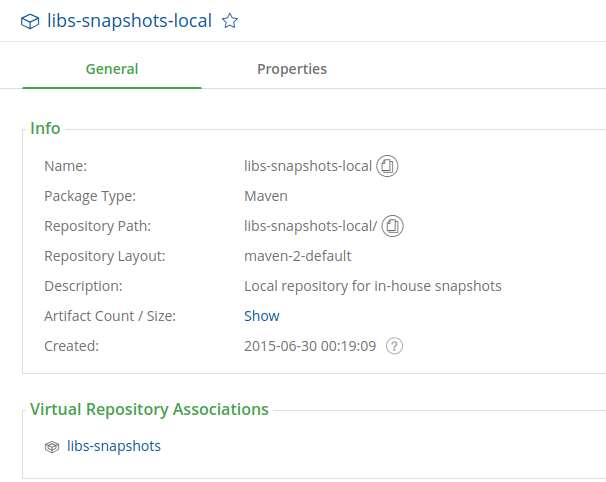
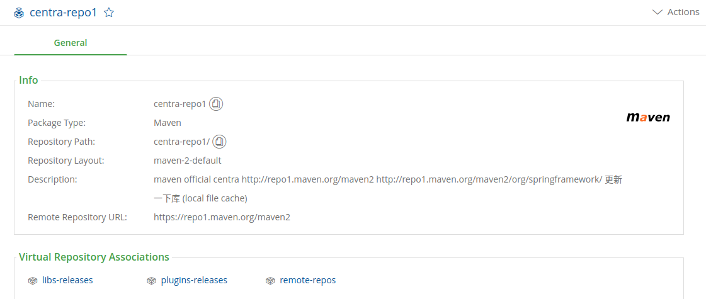
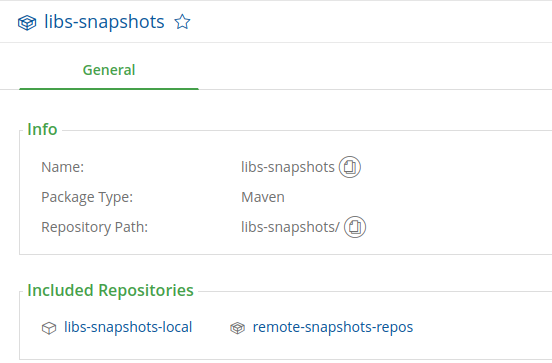

#### 一、JFrog的仓库类型
##### 1. 本地仓库
本地仓库是本地管理的物理仓库，可以deploy构件。

##### 2. 远程仓库
远程管理的仓库，本地仓库有可能是其他的仓库的远程仓库。

##### 3. 虚拟仓库
虚拟仓库又称仓库组，可以聚合多个仓库为一个相同的URL。

#### 二、maven的仓库类型
狭义上：maven仓库 = 中央仓库 + 远程仓库 + 本机仓库
广义上：maven仓库 = 远程仓库（含中央仓库）+ 本机仓库

以下定义按狭义来说明：
##### 1. 中央仓库
Maven中央存储库是由Maven社区提供的资源库，它包含了大量的常用程序库。地址为：http://repo1.maven.org/maven2/。可通过在settings.xml文件中声明仓库id为central覆盖。
##### 2. 远程仓库
远程仓库是对中央仓库的补充，有些构建并没有发布到中央仓库维护，而是由其他组织，公司或个人维护。此时需要手动在settings.xml或pom.xml中声明所需的远程仓库。

#### 三、maven构建时查找构建顺序
1. 本机仓库：~/.m2/repository
1. 中央仓库：默认的maven社区提供的仓库，或本地settings.xml配置的覆盖的仓库；
3. 远程仓库：settings.xml，pom.xml中指定的仓库；
#### 四、settings.xml中配置仓库认证

1. 标签路径：settings -> servers -> server
2. 针对仓库id，配置认证方式；当下载或发布的仓库需要认证时，会从中获取认证信息；
#### 五、配置下载仓库
##### 5.1 settings.xml中配置下载仓库

1. 标签路径：settings -> profiles -> profile -> repositories -> repository
1. 此仓库是maven构建时`用于下载构建`的仓库；
1. 此仓库`一般配置为虚拟仓库`，因为一个虚拟仓库可以聚合多个仓库，好管理；
4. 其ID和发布仓库ID不在一个命名空间，可以同名；

##### 5.2 pom.xml中配置下载仓库

1. project -> repositories -> repository
2. 其他属性同5.1

#### 六、pom.xml中配置部署仓库

1. 此处仓库是maven`用于发布上传构建`的目标仓库；
2. 此仓库为`JFrog中的本地仓库`，因为上传必须有个准确的目的库；
3. 其ID和远程仓库ID不在一个命名空间，可以同名；

#### 参考

1. [https://www.jfrog.com/confluence/display/RTF6X/Configuring+Repositories](https://www.jfrog.com/confluence/display/RTF6X/Configuring+Repositories)
2. [https://www.yiibai.com/maven/maven_repositories.html](https://www.yiibai.com/maven/maven_repositories.html)
3. [http://maven.apache.org/xsd/settings-1.1.0.xsd](http://maven.apache.org/xsd/settings-1.1.0.xsd)