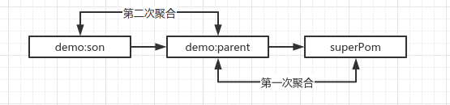

#### 零、假设有两个POM

1）父POM

```xml
<?xml version="1.0" encoding="UTF-8"?>
<project xmlns="http://maven.apache.org/POM/4.0.0"
         xmlns:xsi="http://www.w3.org/2001/XMLSchema-instance"
         xsi:schemaLocation="http://maven.apache.org/POM/4.0.0 http://maven.apache.org/xsd/maven-4.0.0.xsd">
    <modelVersion>4.0.0</modelVersion>
    <groupId>demo</groupId>
    <artifactId>demo-parent</artifactId>
    <version>1.0.0-SNAPSHOT</version>
    <packaging>pom</packaging>
    <modules>
        <module>demo-son</module>
    </modules>
    <properties>
        <dependency.group>group-parent</dependency.group>
        <dependency.artifact>artifact-parent</dependency.artifact>
    </properties>
</project>
```

2）子POM

```xml
<?xml version="1.0" encoding="UTF-8"?>
<project xmlns="http://maven.apache.org/POM/4.0.0"
         xmlns:xsi="http://www.w3.org/2001/XMLSchema-instance"
         xsi:schemaLocation="http://maven.apache.org/POM/4.0.0 http://maven.apache.org/xsd/maven-4.0.0.xsd">
    <parent>
        <groupId>demo</groupId>
        <artifactId>demo-parent</artifactId>
        <version>1.0.0-SNAPSHOT</version>
    </parent>
    <modelVersion>4.0.0</modelVersion>
    <artifactId>demo-son</artifactId>
    <properties>
        <dependency.artifact>son</dependency.artifact>
        <project.version>1.1.1-SNAPSHOT</project.version>
    </properties>
    <dependencies>
        <dependency>
            <groupId>${dependency.group}</groupId>
            <artifactId>${dependency.artifact}</artifactId>
            <version>${project.version}</version>
        </dependency>
    </dependencies>
</project>
```

#### 一、DefaultProjectBuilder#build

> 参考源码：org.apache.maven.project.DefaultProjectBuilder#build

```java
    @Override
    public ModelBuildingResult build( ModelBuildingRequest request )
        throws ModelBuildingException
    {
        // phase 1
        DefaultModelBuildingResult result = new DefaultModelBuildingResult();
        DefaultModelProblemCollector problems = new DefaultModelProblemCollector( result );

        // ignore profile logic

        ModelData resultData = new ModelData( request.getModelSource(), inputModel );
        ModelData superData = new ModelData( null, getSuperModel() );

        Collection<String> parentIds = new LinkedHashSet<>();
        List<ModelData> lineage = new ArrayList<>();

        for ( ModelData currentData = resultData; currentData != null; )
        {
            lineage.add( currentData );
            Model rawModel = currentData.getModel();
            currentData.setRawModel( rawModel );
            Model tmpModel = rawModel.clone();
            currentData.setModel( tmpModel );
            // model normalization, 去重
            modelNormalizer.mergeDuplicates( tmpModel, request, problems );
            
            // 当前POM是超级POM时Break
            if (currentData == superData) {
                break;
            }

            configureResolver( request.getModelResolver(), tmpModel, problems );
            ModelData parentData = readParent( tmpModel, currentData.getSource(), request, problems );

            // 使迭代依次向上找父POM，把他们放入lineage集合内
            if ( parentData == null ) {
                currentData = superData;
            } else if ( currentData == resultData ) { // 首次迭代，设置pom的继承属性
                currentData.setGroupId( currentData.getRawModel().getGroupId() == null ? parentData.getGroupId() : currentData.getRawModel().getGroupId() );
                currentData.setVersion( currentData.getRawModel().getVersion() == null ? parentData.getVersion() : currentData.getRawModel().getVersion() );
                currentData.setArtifactId( currentData.getRawModel().getArtifactId() );
                parentIds.add( currentData.getId() );

                currentData = parentData;
            } else if (!parentIds.add( parentData.getId())) { // 判断父POM循环
                throw new RuntimeException("The parents form a cycle");
            } else {
                currentData = parentData;
            }
        }

        // inheritance assembly，聚合配置和依赖（关键点一）
        assembleInheritance( lineage, request, problems );
        Model resultModel = resultData.getModel();
        
        // model interpolation，解析依赖中的属性（关键点二）
        resultModel = interpolateModel( resultModel, request, problems );
        resultData.setModel( resultModel );

        if ( resultModel.getParent() != null )
        {
            final ModelData parentData = lineage.get( 1 );
            if ( parentData.getVersion() == null || parentData.getVersion().contains( "${" ) ) {
                final Model interpolatedParent = interpolateModel( parentData.getModel(), request, problems );
                // parentData.setModel( interpolatedParent );
                parentData.setVersion( interpolatedParent.getVersion() );
            }
        }

        // url normalization
        modelUrlNormalizer.normalize( resultModel, request );

        // Now the fully interpolated model is available: reconfigure the resolver
        configureResolver( request.getModelResolver(), resultModel, problems, true );

        resultData.setGroupId( resultModel.getGroupId() );
        resultData.setArtifactId( resultModel.getArtifactId() );
        resultData.setVersion( resultModel.getVersion() );

        result.setEffectiveModel( resultModel );

        for ( ModelData currentData : lineage ) {
            String modelId = ( currentData != superData ) ? currentData.getId() : "";
            result.addModelId( modelId );
            result.setActivePomProfiles( modelId, currentData.getActiveProfiles() );
            result.setRawModel( modelId, currentData.getRawModel() );
        }

        if (!request.isTwoPhaseBuilding()) {
            build( request, result );
        }

        return result;
    }
```

1）lineage通过迭代父POM后有以下三个元素：


2）聚合时从后往前聚合：



#### 二、ModelMerger#mergeModel

> org.apache.maven.model.merge.ModelMerger

```java
protected void mergeModel( Model target, Model source, boolean sourceDominant, Map<Object, Object> context )
    {
        mergeModelBase( target, source, sourceDominant, context );

        mergeModel_ChildProjectUrlInheritAppendPath( target, source, sourceDominant, context );
        mergeModel_ModelVersion( target, source, sourceDominant, context );
        mergeModel_Parent( target, source, sourceDominant, context );
        mergeModel_GroupId( target, source, sourceDominant, context );
        mergeModel_ArtifactId( target, source, sourceDominant, context );
        mergeModel_Version( target, source, sourceDominant, context );
        mergeModel_Packaging( target, source, sourceDominant, context );
        mergeModel_Name( target, source, sourceDominant, context );
        mergeModel_Description( target, source, sourceDominant, context );
        mergeModel_Url( target, source, sourceDominant, context );
        mergeModel_InceptionYear( target, source, sourceDominant, context );
        mergeModel_Organization( target, source, sourceDominant, context );
        mergeModel_Licenses( target, source, sourceDominant, context );
        mergeModel_MailingLists( target, source, sourceDominant, context );
        mergeModel_Developers( target, source, sourceDominant, context );
        mergeModel_Contributors( target, source, sourceDominant, context );
        mergeModel_IssueManagement( target, source, sourceDominant, context );
        mergeModel_Scm( target, source, sourceDominant, context );
        mergeModel_CiManagement( target, source, sourceDominant, context );
        mergeModel_Prerequisites( target, source, sourceDominant, context );
        mergeModel_Build( target, source, sourceDominant, context );
        mergeModel_Profiles( target, source, sourceDominant, context );
    }
```

#### 三、步骤

Maven构建POM步骤：

1）解析当前POM，然后迭代解析父POM直到SuperPOM。

2）自顶向下进行父子POM合并，如配置，依赖等。即首先合并SuperPOM和POM继承树的最上层POM。

**合并原则：用子POM的属性覆写父POM的相同属性。**