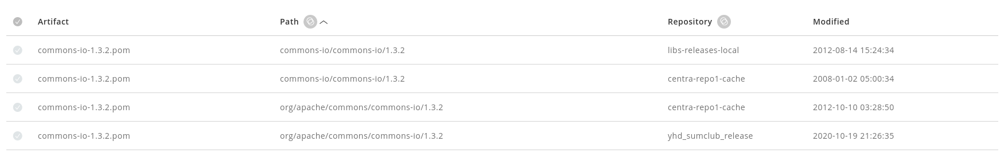

#### 一、问题描述

昨日夜间接到研发反馈，EDI商家新上线后启动异常，需要协助排查，异常信息为：*java.lang.NoSuchMethodError: org.apache.commons.io.IOUtils.toString(Ljava/io/InputStream;Ljava/nio/charset/Charset;)Ljava/lang/String;*

#### 二、问题排查

> 由异常原因可知，肯定是commons-io包发生了冲突。

##### 1）查看打包的commons-io版本

发现打的Package中有两个包：

* commons-io-2.5.jar

* commons-io-1.3.2.jar

由上判断两个包的groupId应该不同，导致maven没有依赖调停。

##### 2）确认两者的groupId是否相同

| jar name             | GroupId in jar | GroupId in pom.xml |
| -------------------- | -------------- | ------------------ |
| commons-io-2.5.jar   | commons-io     | commons-io         |
| commons-io-1.3.2.jar | commons-io     | org.apache.commons |

依赖树解析时根据pom.xml判断，故此处两者的groupId是不同的。

根据maven编译时的下载地址获取两个pom.xml如下：

**commons-io-2.5.jar**

```xml
<?xml version="1.0"?>
<project xmlns="http://maven.apache.org/POM/4.0.0" xmlns:xsi="http://www.w3.org/2001/XMLSchema-instance" xsi:schemaLocation="http://maven.apache.org/POM/4.0.0 http://maven.apache.org/maven-v4_0_0.xsd">
  <parent>
    <groupId>org.apache.commons</groupId>
    <artifactId>commons-parent</artifactId>
    <version>39</version>
  </parent>
  <modelVersion>4.0.0</modelVersion>
  <groupId>commons-io</groupId>
  <artifactId>commons-io</artifactId>
  <version>2.5</version>
  <name>Apache Commons IO</name>
    ...

</project>
```

**commons-io-1.3.2.jar**

```xml
<?xml version="1.0" encoding="UTF-8"?>
<project xsi:schemaLocation="http://maven.apache.org/POM/4.0.0 http://maven.apache.org/xsd/maven-4.0.0.xsd" xmlns="http://maven.apache.org/POM/4.0.0"
    xmlns:xsi="http://www.w3.org/2001/XMLSchema-instance">
  <modelVersion>4.0.0</modelVersion>
  <groupId>org.apache.commons</groupId>
  <artifactId>commons-io</artifactId>
  <version>1.3.2</version>
  <description>POM was created by Sonatype Nexus</description>
</project>
```

以上发现两者的groupId不同，印证了第一步猜测。

##### 3）对比与之前编译日志，找到处理commons-io时是否有差异

> 已知公司内部私服在白天下午发生故障，执行了恢复操作。而冲突在此之后，期间工程的pom.xml未发生变化。

**无commons-io冲突日志**

```
Downloaded from central: http://artifactory.jd.com/libs-releases/org/apache/apache/16/apache-16.pom (16 kB at 574 kB/s)
Downloading from central: http://artifactory.jd.com/libs-releases/org/apache/commons/commons-io/1.3.2/commons-io-1.3.2.pom
Progress (1): 640 B
                   
Downloaded from central: http://artifactory.jd.com/libs-releases/org/apache/commons/commons-io/1.3.2/commons-io-1.3.2.pom (640 B at 28 kB/s)
Downloading from central: http://artifactory.jd.com/libs-releases/commons-io/commons-io/1.3.2/commons-io-1.3.2.pom
Progress (1): 2.2/11 kB
Progress (1): 6.3/11 kB
Progress (1): 10/11 kB 
Progress (1): 11 kB   
                   
Downloaded from central: http://artifactory.jd.com/libs-releases/commons-io/commons-io/1.3.2/commons-io-1.3.2.pom (11 kB at 450 kB/s)
```

**有commons-io冲突日志**

```
Downloading from central: http://artifactory.jd.com/libs-releases/org/apache/commons/commons-io/1.3.2/commons-io-1.3.2.pom
Progress (1): 464 B
                   
Downloaded from central: http://artifactory.jd.com/libs-releases/org/apache/commons/commons-io/1.3.2/commons-io-1.3.2.pom (464 B at 18 kB/s)
```

从日志里看，两者在下载commons-io-1.3.2.pom时有差异。

无冲突的进行了重定向操作，这就可以解释之前为何没有commons-io冲突了。

*http://artifactory.jd.com/libs-releases/org/apache/commons/commons-io/1.3.2/commons-io-1.3.2.pom*

重定向为：

*http://artifactory.jd.com/libs-releases/commons-io/commons-io/1.3.2/commons-io-1.3.2.pom*

##### 4）查看本地缓存的旧pom

路径*.m2/org/apache/commons/common-io/1.3.2/commons-io-1.3.2.pom*

```xml
<?xml version="1.0" encoding="UTF-8"?>
<project xmlns="http://maven.apache.org/POM/4.0.0" xmlns:xsi="http://www.w3.org/2001/XMLSchema-instance" xsi:schemaLocation="http://maven.apache.org/POM/4.0.0 http://maven.apache.org/xsd/maven-4.0.0.xsd">
  <modelVersion>4.0.0</modelVersion>
  <groupId>org.apache.commons</groupId>
  <artifactId>commons-io</artifactId>
  <version>1.3.2</version>
  <distributionManagement>
    <relocation>
      <groupId>commons-io</groupId>
      <artifactId>commons-io</artifactId>
      <message>https://issues.sonatype.org/browse/MVNCENTRAL-244</message>
    </relocation>
  </distributionManagement>
</project>
```

发现本地缓存的pom有relocation标签，进行了重定向操作。也解释了之前无冲突时，commons-io重定向下载。

##### 5）查看公司内部私服

发现有两个仓库内都有这个commons-io-1.3.2.pom。



其中中心仓库的pom是带relocation标签的，而yhd_sumclub_release仓库则是不带relocation标签的。

由此猜测下载时使用了yhd_sumclub_release的pom，导致了本次冲突。

#### 三、问题原因

经排查应该是公司内新增yhd_sumclub_release仓库中的错误pom文件导致了冲突。需要及时反馈给相关团队。

