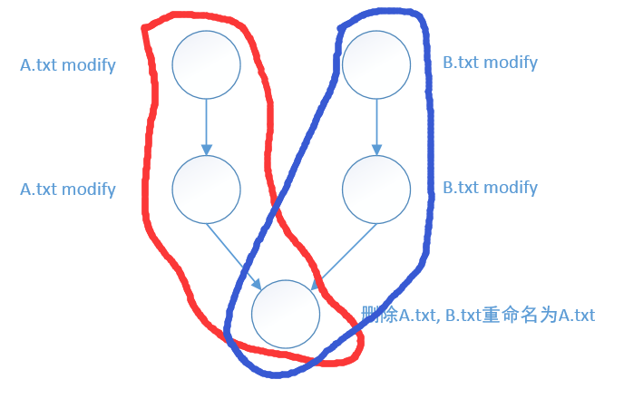
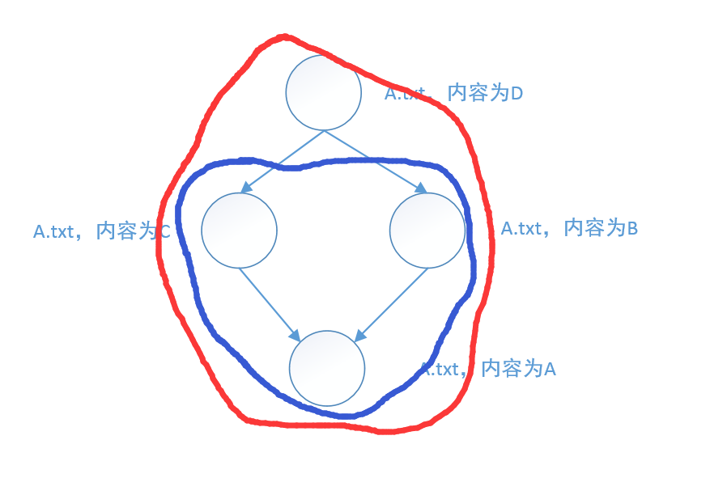
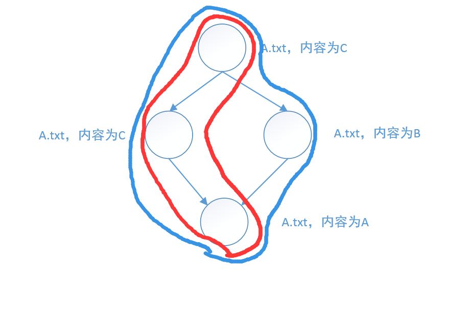

>`git help log`中这样解释--follow参数
>--follow:
>     Continue listing the history of a file beyond renames (works only for a single file).

``` 
git log A.txt   # 显示红色区域的提交
git log --follow A.txt  # 显示蓝色区域的提交
```
#### 案例一



#### 案例二



#### 案例三
