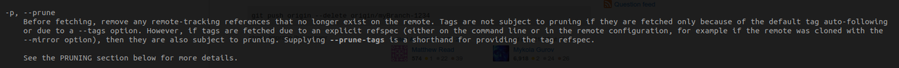

#### 一、操作
执行命令`git push origin :branchA`，出现异常“unable to delete remote ref does not exist”。

#### 二、原因
本地有远程分支的缓存，虽然远程已经不存在该分支，但本地执行`git branch -r`仍能看到。

#### 三、解决方案
执行命令`git fetch --prune origin`，更新本地分支缓存。

