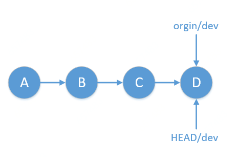
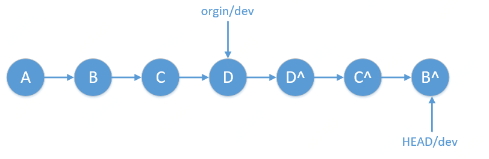
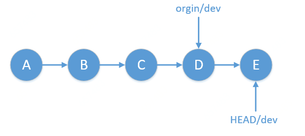

>1）本地私有分支：本地的分支未跟踪（not track）任何远程仓库的分支，不会push到远程，`只有自己可见`；
>2）非本地私有分支：本地的分支跟踪（track）远程仓库的某分支，`该仓库的开发团队都可见`；

非本地私有分支要恢复至某个指定版本是大家常常会遇到的一个问题。假如当前提交历史为：

如果我们要恢复到A，有两种方式：
#### 1. 通过revert命令（`有合并节点或间隔距离较远时不建议使用`）
* 命令
`git revert A..HEAD`
* 结果——产生多个提交

#### 2. 通过reset命令（`建议使用`）
* 命令
1 ) `git reset --hard A`  # ① git的工作区、暂存区变为版本A的内容；② HEAD及当前分支dev指向A
2 ) `git reset --soft origin/dev` # HEAD及当前分支dev指向origin/dev
3 ) `git commit -m 'reset to rivision A'` # 产生一个新的提交

* 结果——产生一个提交
