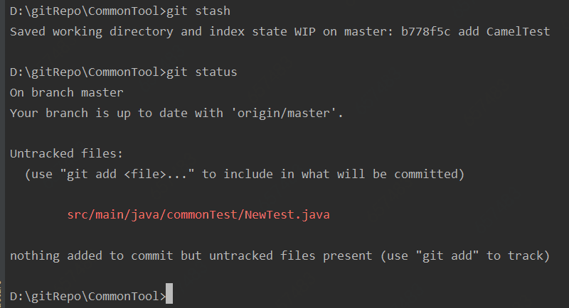
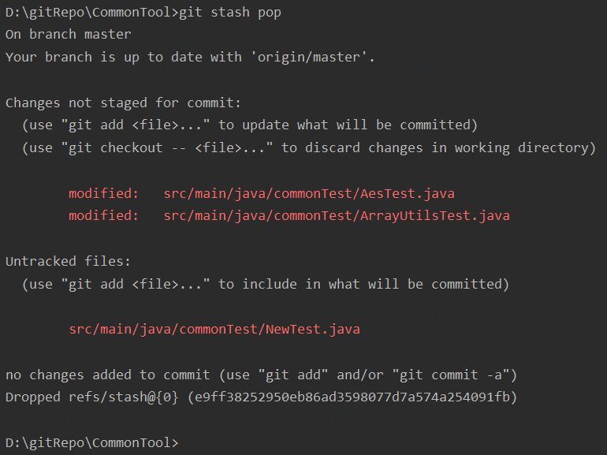

#### 1. 简介
1. 执行`git stash`命令，发现只会把已跟踪的文件暂存起来：

2. 然后执行`git stash pop`，发现之前的暂存区的状态会丢失：

#### 2. 深入git stash的参数
1.. 暂存所有状态的文件：`git stash --all`

2. 恢复暂存前所有状态：`git stash apply|pop --index`

#### 3. 总结
由于之前没有深入去研究过stash的相关参数，导致之前一直都是通过git add操作把新增文件先跟踪，然后再执行stash。虽然也可以实现--all的功能，但是太过蹩脚。
以后要多研究相关命令的选项，减少蹩脚的多余操作。