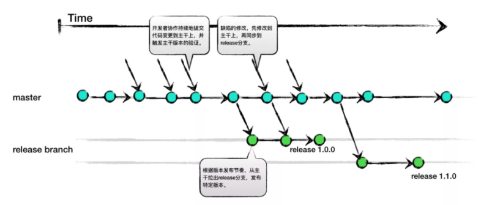
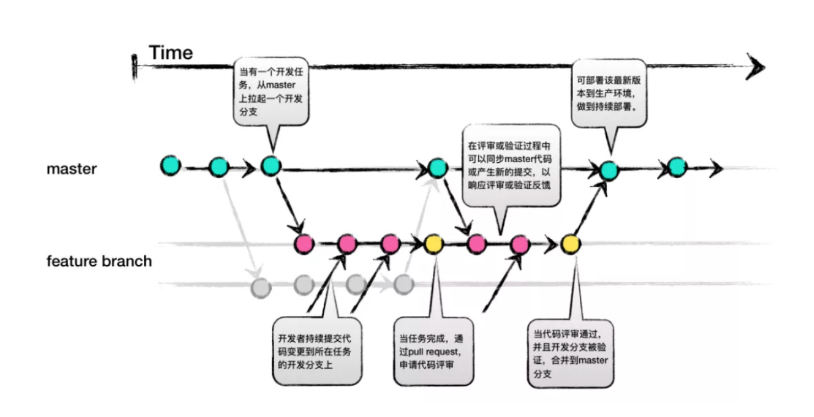
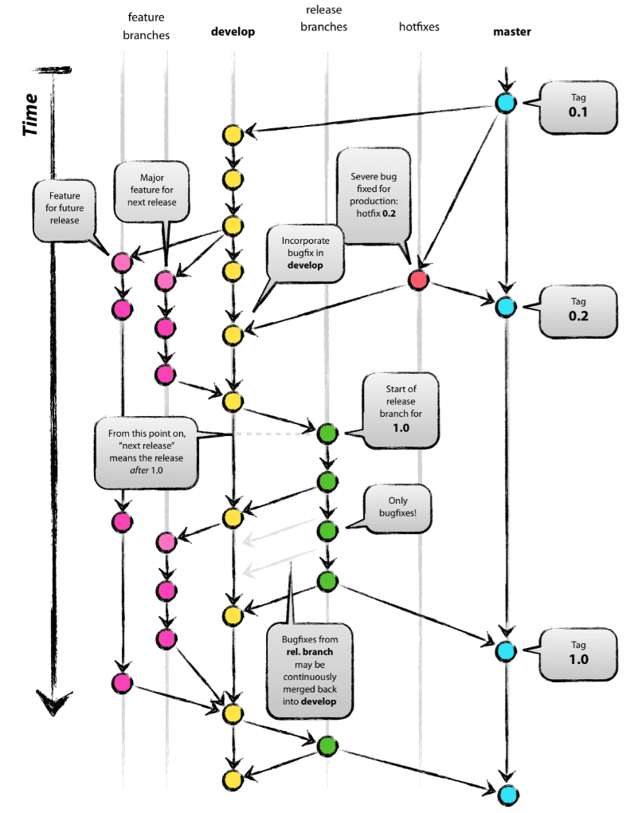
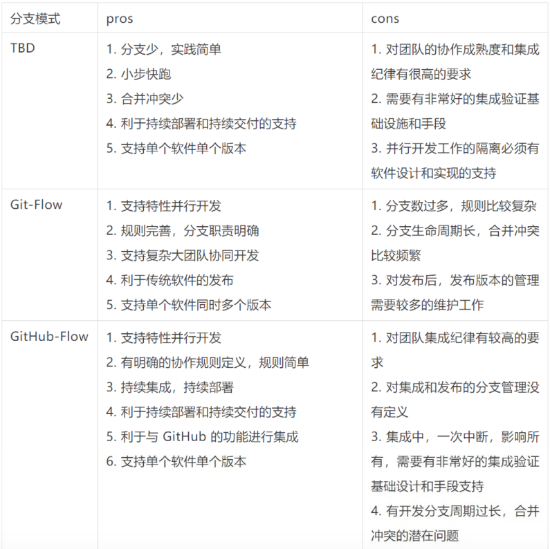

#### 一、TBD：Trunk-based development
##### 1. 特点：

* TBD的特点是所有团队成员都在单个主干分支上进行开发。
* 简单易操作，减少分支切换，流行于SVN（svn trunck = git master）

##### 2. 流程：

* 当需要发布时，先考虑使用标签（`tag`）,即`tag`某个`commit`来作为发布的版本。
* 如果仅仅依靠`tag`不能满足要求，则从主干分支创建发布分支。
* `bug`修复在主干分支进行，再`cherry-pick`到发布分支

#### 二、[Git Flow](https://nvie.com/posts/a-successful-git-branching-model/)
##### 1. 适合场景

* 适合维护多个发布版本
* 流程较其他工作流复杂

##### 2. 分支描述
1）长期分支

* develop：开发分支，稳定后可并入master；
* master：HEAD总处于可发布态；每个版本对应一个tag；

2）辅助分支

##### feature

* 通常是本地分支，合并回develop后删除；
* may from `develop`
* must merge back to `develop`
      * (develop)：git merge --no-ff，体现出特性

##### release

* 合并回master和develop后删除；
* may from `develop`
* must merge back to `develop` and `master`
      * (master)：git merge --no-ff，体现出特性
      * (devlop)：git merge --no-ff，体现出特性
* 迁出分支后，首先修改为新版本号；

##### hotfix
* May from master
* Must merge back to `develop` and `master`
      * (master)：git merge --no-ff，体现出特性
      * (devlop)：git merge --no-ff，体现出特性（当release分支存在时优先合并进release分支，由release分支合并进develop）
* 迁出分支后，首先修改为新版本号；

#### 3. GitHub Flow
1）特点：
* 简单实用

2）流程
* `master`分支中也是代表着稳定的代码。该分支已经或即将被部署在生产环境
* 当需要进行任何修改时，总是从`master`分支创建新分支。完成之后通过`pull request`和相关的代码审查来合并回`master`分支
* hotfix, feature分支都遵循上面的准则；

##### 4. 对比

参考
1. [https://www.atlassian.com/git/tutorials/comparing-workflows](https://www.atlassian.com/git/tutorials/comparing-workflows)
1. [https://nvie.com/posts/a-successful-git-branching-model/](https://nvie.com/posts/a-successful-git-branching-model/)
1. [https://tonydeng.github.io/2017/08/31/git-common-branch-management-practices/](https://tonydeng.github.io/2017/08/31/git-common-branch-management-practices/)