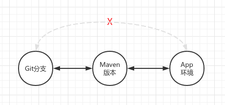
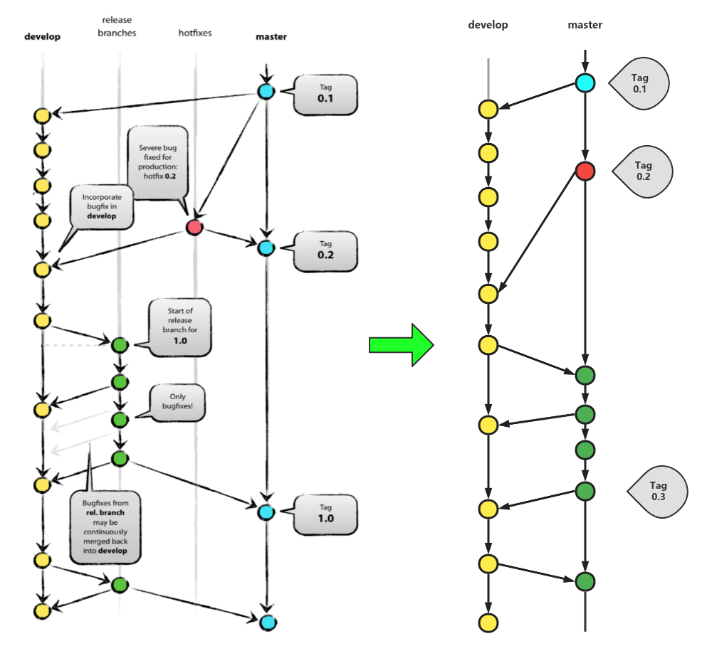

> 常见的工作流去管理Git仓库时，一般基于一个前提：Git仓库上远程可见分支一般为近期需要上线的功能。不会穿插两个不同时间线上线的功能。这也就是Git使用时一般基于Merge而很少使用cherry-pick。
>
> 当Git仓库两个分支的代码差异过大，已经达到无法合并的时候，就可以考虑把他们拆成两个仓库。一般看来，Git里的分支都是潜在可合并的。也就是说代码是同构的，相异不大。

### 一、工作流关键点

1）三个主体

* Git分支
* Maven版本
* 应用环境

2）三个主体关系

> 如图，实线相连的有直接关联，需线则无直接关联。避免三个实体关系两两相连，减小工作流的复杂度。

### 二、Git Flow实践繁琐分析

* 分支功能粒度小，一次需求迭代中需要在多个分支跃迁
  * 如master分支指稳定态代码，不直接在其上进行开发，其来源只能来自release，hotfix分支
* 需求在单module仓库的时间周期短，细粒度的分支划分显得繁琐
  * 随着工程结构去单体仓库化，一个应用往往拆分为多个module，而各模块可拥有单独的代码仓库
  * 需求在单module仓库的变更工作量也线性下降，结果反映在需求在单module仓库周期短
* release分支作为短期公开分支，提高了协同难度

### 三、Git Flow简化

1）Git分支功能合并简化 - 归并release/hotfix/master

* master不再表示完全稳定态，而是在稳定态和非稳定态的转换，版本Tag的点为稳定点，两个Tag之间为非稳定态。非稳定态指该module版本的代码还可能发生变更。
* master上可直接作bugfix和release之前的提交功能，减少分支切换。

2）模块Maven版本变更的时机

* develop分支的版本建议带QA标识与master区分，如1.3.1-QA-SNAPSHOT
* develop合并至master时，在master上变更module版本
* master上的bugfix开始前变更版本
* master上打版本tag后变更版本，tag点表示该版本已稳定之后不再变化

3）应用环境和模块Maven版本关系

不同应用环境，如dev，uat，prod依赖一个module版本集合，具体某一module而言，可在dev，uat，prod指定不同版本。

