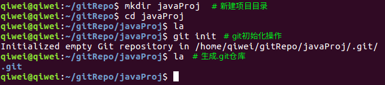
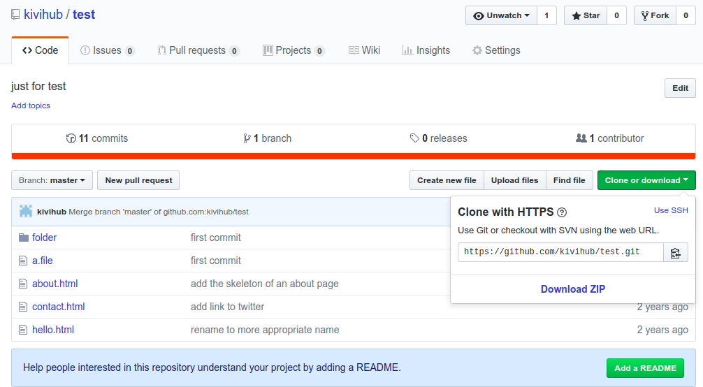
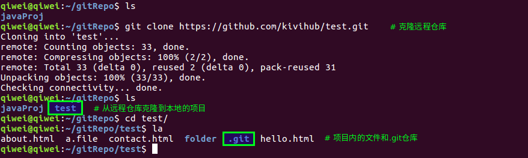
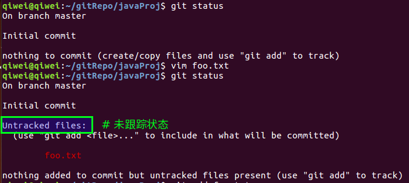
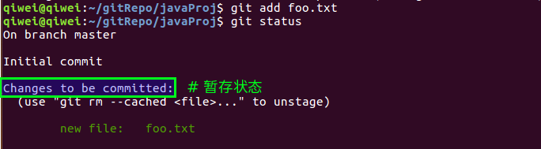
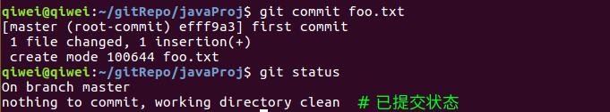
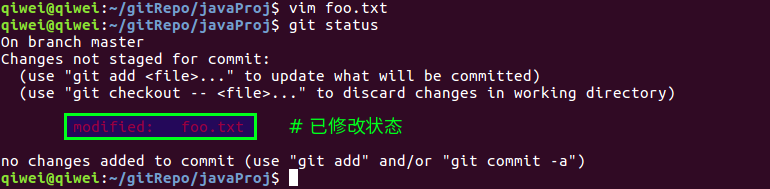
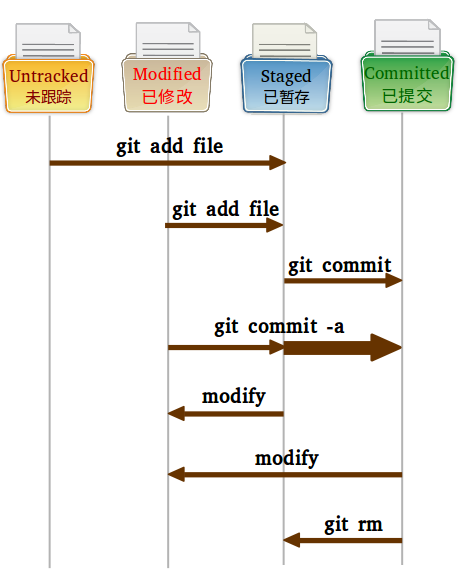
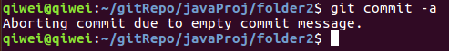

本人把基础操作分为两个部分：1）正常提交操作；2）撤销操作。主要因为撤销操作有多种场景，且同一命令的不同参数的结果可能大相径庭，故单独把撤销操作做为一节。
## 一、获取项目的Git仓库

> 获取项目的Git仓库有两种方式：1）在本地目录初始化Git仓库，通过Git的提交操作新增项目文件至Git仓库，被Git管理；2）通过克隆已有的Git仓库到本地目录，被Git管理。
### 1、Git初始化本地目录

使用`git init`命令初始化当前目录，操作结束后在本地生成.git仓库。



### 2、克隆远程仓库到本地

若要通过克隆的方式的获取Git仓库，只需要知道远程仓库的Git地址，就可以通过`git clone url`的方式将其克隆到本地。

1）远程仓库地址选用本人在GitHub上的一个测试项目，仓库地址为`https://github.com/kivihub/test.git`。



2）通过`git clone https://github.com/kivihub/test.git`克隆远程仓库。



## 二、正常的提交流程

### 1、查看状态

通过`git status`命令查看当前状态。

1）未跟踪状态




2）暂存状态




3）已提交状态




4）已修改状态



### 2、状态变化图




### 3、暂存文件

1）未跟踪文件的暂存操作

* 新建文件**foo.txt**（文件处于**未跟踪**状态）。
* `git add foo.txt`，把文件提交至暂存区（文件处于**已暂存**状态）。

2）已修改文件的暂存操作

  * 编辑**已暂存态**和**已提交态**的文件后，文件新增**已修改状态**。
  * `git add file`，把文件提交至暂存区（文件处于**已暂存**状态）。
### 4、提交文件

1）提交**暂存态**文件
`git commit file`

2）提交**已修改**态（跳过暂存态）和**已暂存**态文件
`git commit -a`

```shell
1.本命令无视当前路径，它会提交`git status`里除`未跟踪态`以外的所有文件至git仓库。
2.相当于执行了两步操作： 
  a. git add 项目的根路径
  b. git commit
```
3）git commit的常用参数

```shell
git commit -a 提交本项目除未跟踪态以外的所有文件至Git仓库。
git commit -m "commit description" -m后空格然后跟着本次提交的描述，可免去进入编辑页面。

Note：
1.编辑页面也有好处，你可以看到本次修改了文件。
2.若想在提交的编辑页面放弃本次提交，则不做输入退出就会放弃提交。
```




### 5、修改/删除文件

1）通过git命令操作，可根据参数修改文件工作区和暂存区的状态。

```shell
# 示例
`git rm file`           # 删除工作区和暂存区的指定文件
相当于执行了两步操作：
1. `rm file` 
2. `git add file`

`git rm --cached file`  # 只删除暂存区的指定文件，保留工作区的文件。
例如：一个应用场景是误将本该ignore的文件提交至暂存区，可进行如下操作：
1.通过此命令删除暂存区文件后，保留工作区文件
2.然后通过编辑.gitigore或者exlude文件忽略该文件
```
2）非git命令操作：按序执行**修改→暂存→提交**操作。

### 6、查看历史和差异

1）查看历史  `git log`

```shell
`git log`常用参数
-g                # 查看全部历史，相当于执行 git reflog
--oneline         # 显示为一行
--graph           # 图像化显示
--all             # 显示所有分支
--decorate        # 标注分支和标签
-number           # 显示近number次提交信息
-p                # 按补丁格式显示每次更新的差异（与git diff内容一致）
--stat            # 显示每次更新的文件修改统计信息
```
> Note：可通过gitk命令运行图形化版本查看工具。Debian系列Linux发行版可通过`sudo apt install gitk`命令进行安装。


2）查看差异 `git diff`

```shell
`git diff`   # 比较工作区和暂存区的差异

`git diff --cached `    # 比较暂存区和Git仓库的差异
`git diff --cached [commit|branch|tag]`    # 比较暂存区与指定commit的差异

`git diff HEAD`  # 比较工作区和Git仓库的差异
`git diff [commit|branch|tag]`    # 比较工作区和指定commit的差异

`git diff [commit|branch|tag] [commit|branch|tag]`   # 比较两个commit的差异

# Note:以上命令后面都增加文件路径，指定查看具体目录或文件的差异。
```


## 附：常用shell操作命令

```shell
# 在Linux的shell里进行命令操作时难免会输错单词，这时可通过以下几个命令快速修正
`ctrl + w`   # 删除光标前一个word（等同于Vim编辑态的`ctrl + w`)
`ctrl + u`   # 清空本行（等同于Vim编辑态的`ctrl + u`）
`ctrl + l`   # 清屏，相当于执行`clear`
`ctrl + d`   # 退出shell，县挡土相当于执行`exit`
`cd`         # 进入当前用户home
`cd -`       # 返回刚才目录
`ln -s 源目录 目录连接` # 建立目录的软连接，例如：可在用户home建立git仓库的软连接，减少目录的切换操作。
`[tab][tab]` # 连续两次tab键，会提示当前的可能命令组合或可选路径
```