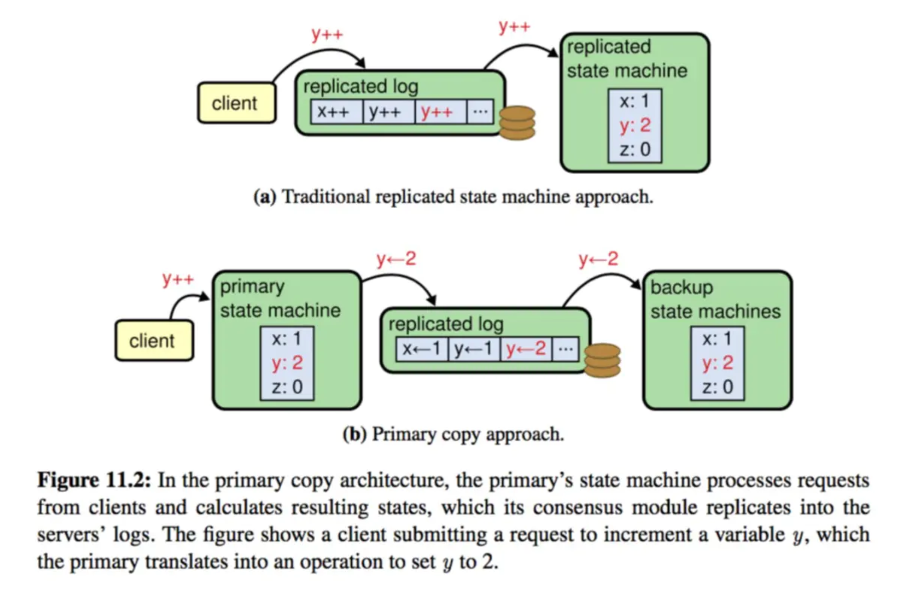

## 一、分布式网络的概念

### 1、分布式网络的必要性

网络上的有些服务提供者（如消息队列，ElasticSearch，Redis，Zookeeper等）需要通过水平扩展的方式来扩展其计算能力，存储能力，故障容错能力。

### 2、分布式网络的分类

分布式网络的根据观察角度不同，分类也多种多样。

#### 1）结点通讯类型

I、同步分布式网络

II、异步分布式网络

#### 2）规模和授权

I、封闭分布式网络

II、许可私有网络

III、无许可开放分布式网络，如比特币等区块链

#### 3）协调类型

I、有中心的分布式网络

II、无中心的对等式分布网络

### 3、分布式网络的挑战

分布式网络带来资源水平扩展好处的同时，也带来了一些挑战：

1）应用分布式网络的系统比单机系统更加复杂，提高了理解和运维难度

2）需要协调分布式网络的各结点，维护良好的集群状态

3）维护各结点数据一致性，尽量使客户端不出现脏读，脏写

4）结点故障和恢复时有相应的故障容错机制，不影响系统的可用性、可靠性

5）允许集群能平滑扩容或缩容

### 4、两种故障容错

1）Crash Fault Tolerance

该容错机制下，系统可以应对一定数量的结点宕机，而不影响系统可用性。但如果结点违反系统的规则，例如被黑客控制后在集群中发送错误的信息，则可能破坏集群的状态，无法提供对外服务。一般用于封闭的，有权限控制的分布式网络。

2）Byzantine Fault Tolerance

其可以处理各种类型的结点异常，例如结点发送错误的信息，只要异常结点的比例不超过安全阈值则不会影响系统的可靠性，可用性。一般用于开放的，无权限控制的分布式网络。

## 二、分布式网络的重要理论

### 1、CAP

CAP理论是指在一个数据共享的系统中，当发生网络分区（Network Partitions）时，只能在一致性（Consistency）和可用性（Availability）之间作出选择。网络分区是一种故障类型，不是一个选项。

[EricBrewer提出该理论是为了提供一种系统设计的思路](https://www.infoq.cn/article/cap-twelve-years-later-how-the-rules-have-changed/)，不要只关注于ACID这种强一致性的设计。而系统的设计师在设计系统时，对这三个特性持有错误的“三选二”的观点。该观点是有误导性的。这三个特性都是不是“非黑即白的”，例如，可用性是0%-100%的一个区间值，[一致性也具备多种等级](https://www.infoq.cn/article/2008/01/consistency-vs-availability)，分区容错也分为整体可用还是局部大数可用。在设计系统时可以根据系统的特性进行权衡。

由于CAP的各个特性都有多态性，所以需要在使用时[需要明确各个特性的范围](https://developer.aliyun.com/article/700488)。另外，在系统正常运行时，三个特性是可以同时满足的，只有发生了网络分区时，才需要在一致性和可用性之间进行权衡。

### 2、BASE和ACID

同CAP提出的背景一样，BASE理论也是为了开阔系统设计的空间。使开发人员不要拘泥于ACID的优点，在特定的场景下可以牺牲强一致性提高系统的可用性。

> ACID 和 BASE 代表了两种截然相反的设计哲学，分处一致性 - 可用性分布图谱的两极。ACID 注重一致性，是数据库的传统设计思路

[ACID和BASE对比](https://people.eecs.berkeley.edu/~brewer/cs262b-2004/PODC-keynote.pdf)

BASE理论是以下特性的缩写：

1）基本可用，Basically Available

系统发生故障时，通过降级等措施保证系统仍能提供服务。

2）软状态，Soft state

对比ACID的数据强一致状态，允许系统内结点的数据处于一种中间状态（如使法定的数据节点同步的方式处于一致，允许少数结点异步达到一致），在一定时间过后达到数据最终一致性。

3）最终一致，Eventually consistent

Werner [Vogels对最终一致性又细分了不同的程度](https://www.infoq.cn/article/2008/01/consistency-vs-availability)，如下：

* 因果一致性
* 读己之所写一致性
* 会话（Session）一致性
* 单调（Monotonic）读一致性
* 单调写一致性

### 3、FLP

FLP是三位作者的名字首字母，1985年由Fischer, Lynch和Patterson发表的[Impossibility of Distributed Consensus with One Faulty Process](https://zoo.cs.yale.edu/classes/cs426/2012/bib/fischer85impossibility.pdf)理论。该理论的结论是**在异步模型中，分布式系统中只要有一个进程不可用（失去响应或暂停），就可能无法达成整体的共识。**

## 三、共识协议

### 1、共识协议目标

共识是分布式系统一致性的描述，具体而言是分布式集群的各结点对某个值达成一致。而共识协议就是为了分布式系统对共享数据达成一致的策略和方法。

共识协议需要识别和处理由系统故障、恶意结点、网络故障导致的网络分区问题，以及故障恢复后如何重新达成一致。这期间就需要CAP中的C和A进行权衡。一种取得共识的方式是大数定律，当某结点提出一个Cadidate值后，只需要集群中大多数结点同意便认为达成共识，这其中处于另一侧网络分区的结点或恶意结点可能会破坏这种一致性，共识协议必须考虑此种情况。

共识协议的应用包含：

**a、哪些事务以什么顺序提交到数据库**

**b、状态机复制（注意primary-backup与state machine replication区别）**

常见算法有Paxos，Raft。

> 引自：https://www.cs.cornell.edu/fbs/publications/viveLaDifference.pdf
> 
> • With active replication, also known as state machine replication, each replica implements a deterministic state machine. All replicas process the same operations in the same order. 
> 
> • With passive replication, also known as primary backup , a primary replica runs a deterministic state machine, while backups only store copies of the primary replica’s state. The primary computes a sequence of new application states by processing operations and forward

简而言之，state machine replication的各个副本接收命令序列并执行，命令会执行多次，不适合Random这类随机的输出。primary-backup中命令只在主副本中执行一次，然后把结果同步给其他副本，可满足Random随机输出。zookeeper就属于primary-back。

**c、原子广播**

常见协议：zookeeper的共识算法ZAB。

原子广播用在分布式系统中，一个提议被广播到其他结点，结果要么是全部接收，要么全部拒绝。

### 2、常见共识算法

| 网络        | 特点                       | 共识算法            |
| --------- | ------------------------ | --------------- |
| 封闭分布式网络   | 可靠的分布式网络（权限控制，结点数量较小）    | Paxos,Raft,PBFT |
| 许可私有链     | 相对可靠的分布式网络（访问控制，数据保护，监管） | Paxos,Raft,PBFT |
| 无许可公链开放网络 | 不可靠的分布式网络（无访问控制，结点数量无限制） | POW,POS         |

## # 参考

1. [Raft](https://raft.github.io/)
2. [Raft Paper](https://raft.github.io/raft.pdf) [本仓库副本](../../reference/raft.pdf)
3. [Raft PPT](https://raft.github.io/slides/uiuc2016.pdf) [本仓库副本](../../reference/raft-uiuc2016.pdf)
4. [分布式一致性和分布式共识协议](http://www.calvinneo.com/2017/09/20/distributed-system-consistency-and-consensus/)
5. [Elasticsearch 集群协调迎来新时代](https://www.elastic.co/cn/blog/a-new-era-for-cluster-coordination-in-elasticsearch)
6. [alibabacloud - From Distributed Consensus Algorithms to the Blockchain Consensus Mechanism](https://www.alibabacloud.com/blog/from-distributed-consensus-algorithms-to-the-blockchain-consensus-mechanism_595315)
7. [阿里云栖 - 分布式系统：CAP 理论的前世今生](https://developer.aliyun.com/article/700488)
8. [BASE Paper: Cluster-Based Scalable Network Services](http://citeseerx.ist.psu.edu/viewdoc/download?doi=10.1.1.1.2034&rep=rep1&type=pdf)
9. https://www.infoq.cn/article/cap-twelve-years-later-how-the-rules-have-changed/
10. [Werner Vogels 谈最终一致性](https://www.infoq.cn/article/2008/01/consistency-vs-availability)
11. [Eric Brewer: CAP ppt](https://people.eecs.berkeley.edu/~brewer/cs262b-2004/PODC-keynote.pdf)
12. [Paper Study: "Impossibility of Distributed Consensus with One Faulty Process" (FLP Impossibility)](https://zhuanlan.zhihu.com/p/36325917)
13. [维基百科：共识协议](https://en.wikipedia.org/wiki/Consensus_(computer_science))
14. [维基百科：state machine replication](https://en.wikipedia.org/wiki/State_machine_replication)
15. [维基百科：原子广播](https://en.wikipedia.org/wiki/Atomic_broadcast)
16. https://cwiki.apache.org/confluence/display/ZOOKEEPER/Zab+vs.+Paxos
17. [Paper：Paxos vs. Viewstamped Replication vs. Zab 含primary-backup与state machine replication对比](https://www.cs.cornell.edu/fbs/publications/viveLaDifference.pdf)
18. [简书：众协议 Paxos/ZAB/Raft/VR 值得注意的细节](https://www.jianshu.com/p/4dcf3325269d)
