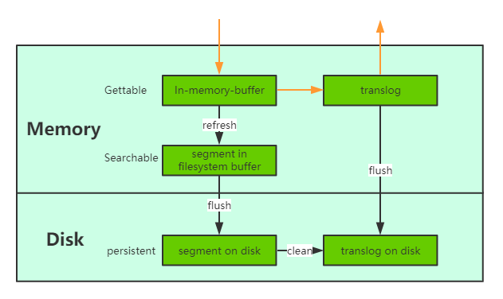

## 一、Redis

### 1、落盘策略

AOF日志会先写入操作系统系统的内存缓冲区，当缓冲区满、超过指定时间、执行fsync命令时会进行落盘。

```properties
# 落盘策略
appendfsync always # 每条命令都刷盘
appendfsync everysec # 每秒刷盘一次，默认选择，兼顾安全和速度
appendfsync no # 交给操作系统
```

### 2、主从复制

主从异步复制

## 二、ZK

### 1、落盘策略

ZK事务日志落盘策略配置

```properties
// 默认强制落盘
zookeeper.forceSync=true
```

### 2、主从复制

主从同步复制：2-phase

I、第一阶段：

* leader写入本地事务日志文件

* leader发出proposal广播给follower

* follower收到proposal，写入本地事务日志文件，返回ACK给leader。

此时leader和follower的写入不可见。

II、第二阶段：

* leader收到主从总和半数以上ACK，进入commit阶段
* leader将事务请求同步至内存，广播Commit命令给follower，响应给客户端。
* follower收到commit请求，读取事务请求到内存

## 三、ES

### 1、落盘策略



参考：https://elasticsearch.cn/article/13533

1）引入**translog**，追加写入。默认同步刷盘。

```properties
index.translog.durability=fsync/async
```

2）先写lucene再写translog，因为luncene可能写失败，为了减少回滚开销，先写luncene。

3）写入关键流程

I、写入lucene

II、写入translog

III、flush translog，刷盘 - 可通过上面配置为异步

IV、发送请求给副本

V、等待副本响应

### 2、主从同步


## 四、Kafka

### 1、落盘策略

默认同步刷盘，producer.type表示mmap修改后是否立即执行flush将其刷至硬盘。

```properties
producer.type=sync/async
```

### 2、主副本同步

https://juejin.cn/post/6857514628516315149

```properties
# broker配置
min.insync.replicas=2

# producer配置
acks=0/1/all
```


