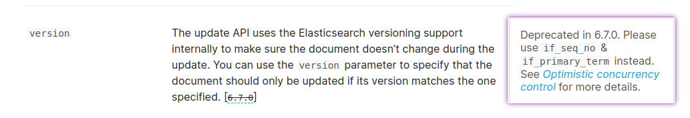
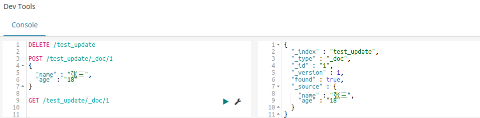
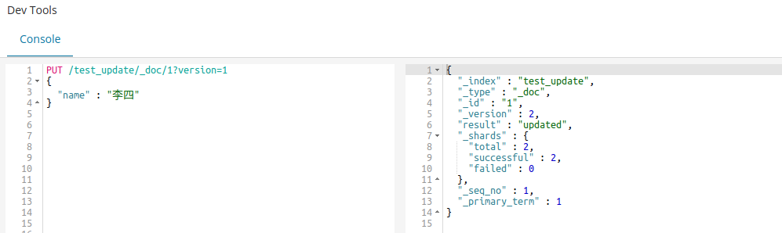
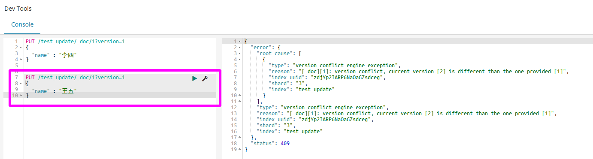

### 一、ES使用乐观锁进行并发控制

[ES官方文档-Update API](https://www.elastic.co/guide/en/elasticsearch/reference/6.8/docs-update.html)中提到ES6.7.0版本前使用`version`字段进行并发控制，而6.7.0开始使用`if_seq_no，if_primary_term`进行并发控制。

#### 二、测试

1）创建测试数据，当前version为1。

2）指定版本号更新数据，第一次更新成功

3）指定相同版本号，进行第二次更新失败

#### 参考

1. [ES 7.13——乐观锁并发控制](https://www.elastic.co/guide/en/elasticsearch/reference/current/optimistic-concurrency-control.html)
2. [Elasticsearch系列---并发控制及乐观锁实现原理](https://segmentfault.com/a/1190000021199668)

