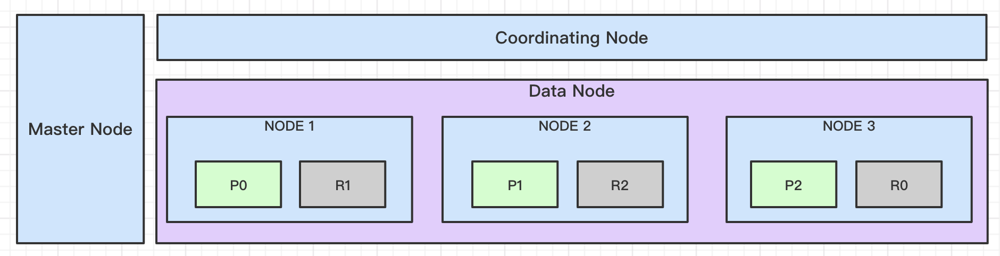
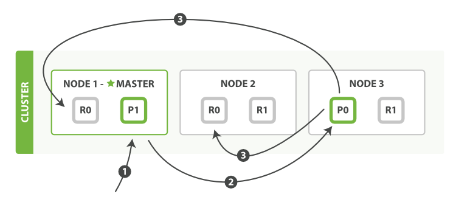
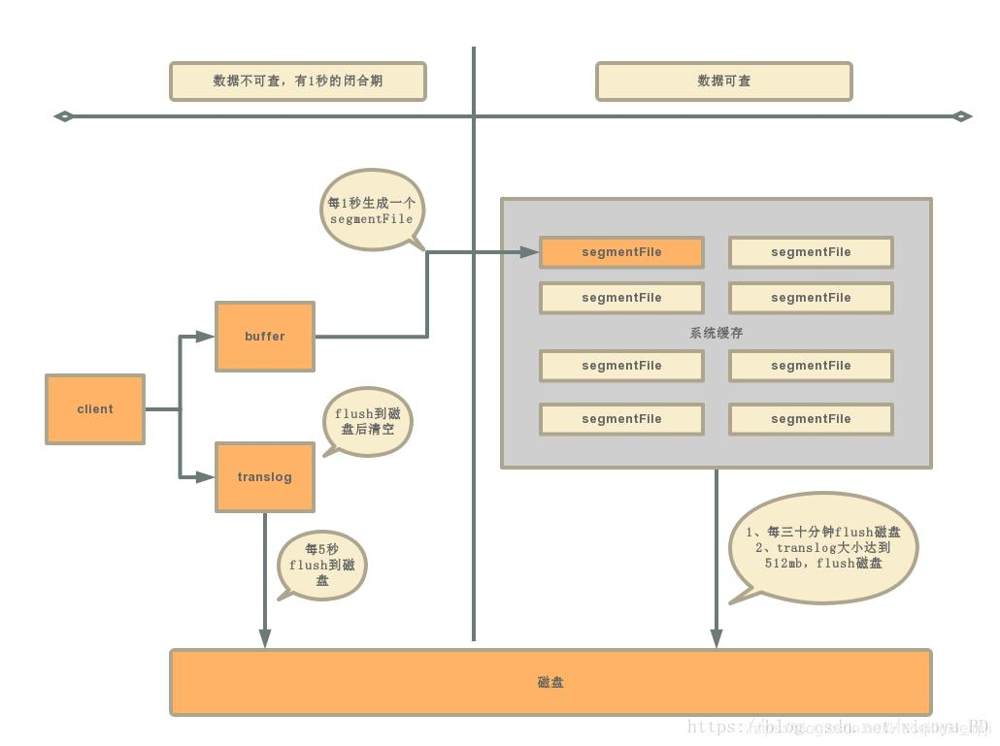

### 一、为什么要设置分片和副本

> 摘自：[动态更新索引](https://www.elastic.co/guide/cn/elasticsearch/guide/current/dynamic-indices.html)
>
> 一个 *Lucene 索引* 我们在 Elasticsearch 称作*分片* 。一个 Elasticsearch *索引* 是分片的集合。 当 Elasticsearch 在索引中搜索的时候， 他发送查询到每一个属于索引的分片(Lucene 索引)，然后像 [*执行分布式检索*](https://www.elastic.co/guide/cn/elasticsearch/guide/current/distributed-search.html) 提到的那样，合并每个分片的结果到一个全局的结果集。

ES是含多个数据节点的分布式存储结构，把一个索引分成多个物理分片，把分片分配到不同的节点上，可以充分利用集群的CPU，磁盘等资源，提高存储和检索效率。且分片也使扩容更加方便。

副本是数据容错的常用方式，其和主分片须在不同节点上。这样主分片所在节点故障时，可以把副本分片选为主分片，保证数据不丢失。另外副本分片还可以分摊查询压力，能更好的负载集群的压力。

### 二、ES的集群结构

#### 1. 集群的3类结点

ES集群中结点根据其职责划分了多类结点（7.13版本称为role）。我们主要关注以下3类结点，而集群的每个结点根据配置可以具有多个类型：

| 结点类型 | 结点职责                                                     | 配置方式                                                     | 资源要求              | 资源规格示例                                                 |
| -------- | ------------------------------------------------------------ | ------------------------------------------------------------ | --------------------- | ------------------------------------------------------------ |
| 主结点   | 负责集群相关操作，如创建，删除索引；跟踪哪些结点是集群的一部分，并决定哪些分片分配给相关结点。 | 1）ES 6.8中，设置`node.master=true`，那么该结点就具备主结点资格 2）ES 7.13中，设置角色为`node.roles: [ master ]` | CPU，内存，IO要求一般 | 2核8G 20GB                                                   |
| 数据结点 | 用于存储索引的数据，主要包含对文档的增删改，聚合操作。       | 1）ES 6.8中，设置`node.data=true`; 2）ES 7.13中，设置角色为`node.roles: [ data ]` | CPU，内存，IO要求较高 | 16核64G，1600GB                                              |
| 协调结点 | 当集群搜索压力大时，可以通过协调结点来进行请求路由，及对请求结果归并返回客户端。 | 默认接收请求的结点都是协调结点，但可以通过配置把让其专司协调工作： 1）ES 6.8中，设置`node.master=false,node.data=false,node.ingest=false` 2）ES 7.13中，设置角色为`node.roles: [ ]` | CPU，内存要求较高     | 2核8G 20GB（由当前查询量较小，故规格较低，正常情况应该与数据结点同等规格） |

#### 2. 集群结构

假如有含1个专用主结点，1个专用协调结点，3个数据节点的ES集群。当前有个Index有三个分片，副本为1。则其集群结构，及索引分片的分布情况如下图所示。

### 三、ES的写入过程

1）客户端发起文档写入请求，协调结点根据如下路由规则计算应该写入到那个分片。

`shard = hash(routing) % number_of_primary_shards`。

> `routing` 是一个可变值，默认是文档的 `_id` ，也可以设置成一个自定义的值。 `routing` 通过 hash 函数生成一个数字，然后这个数字再除以 `number_of_primary_shards` （主分片的数量）后得到 **余数** 。这个分布在 `0` 到 `number_of_primary_shards-1` 之间的余数，就是我们所寻求的文档所在分片的位置。

2）确定好分片位置后，协调结点会把请求转发给含该分片的数据节点；

3）主分片写入后，该数据节点会把请求转发给其副本分片的数据节点；

4）当副本写入成功后（[可设置一致性策略-参考](https://www.elastic.co/guide/cn/elasticsearch/guide/current/distrib-write.html)），返回给协调节点写入成功；

5）协调结点返回客户端写入成功；

### 四、ES的查询过程

#### 1. [搜索一个文档](https://www.elastic.co/guide/cn/elasticsearch/guide/current/distrib-read.html)

1）客户端向协调结点请求文档；

2）协调结点根据文档`_id`确定在哪个分片；

3）协调结点根据某种策略选择其中一个结点的分片，进行请求转发；

4）接受到转发请求的数据结点，检索文档并返回给协调结点；

5）协调结点把结果返回给客户端。

#### 2. [条件搜索文档](https://www.elastic.co/guide/cn/elasticsearch/guide/current/distributed-search.html)

1）查询阶段

ø 客户端发送请求到协调结点，协调结点创建`from + size`的空优先队列

ø 协调结点把查询请求转发到索引的每个主分片或副分片中。每个分片在本地执行查询并添加结果到大小为 `from + size` 的本地有序优先队列中。

ø 每个分片返回各自优先队列中所有文档的 ID 和排序值给协调节点，它合并这些值到自己的优先队列中来产生一个全局排序后的结果列表。

2）取回阶段

ø 协调节点辨别出哪些文档需要被取回并向相关的分片提交多个 `GET` 请求。

ø 每个分片加载并 *丰富* 文档，如果有需要的话，接着返回文档给协调节点。

ø 一旦所有的文档都被取回了，协调节点返回结果给客户端。

### 五、[ES近实时搜索](https://www.elastic.co/guide/cn/elasticsearch/guide/current/near-real-time.html)

1）引入buffer和translog（类似Mysql的写入逻辑）；

2）buffer定时1秒刷新缓存为segmentFile，生成segmentFile后Document可被检索；

3）系统缓存每30分钟刷数据到磁盘或者translog达到512mb后刷入磁盘。

[图片来源](https://www.pianshen.com/article/5547258246/)

### # 参考

1. [ES 2.x - 近实时搜索](https://www.elastic.co/guide/cn/elasticsearch/guide/current/near-real-time.html)
2. [ES 7.13 - 结点类型](https://www.elastic.co/guide/en/elasticsearch/reference/current/modules-node.html)
3. [ES 6.8 - 结点类型](https://www.elastic.co/guide/en/elasticsearch/reference/6.8/modules-node.html)
4. [Elasticsearch学习之ES节点类型以及各种节点的分工](https://www.cnblogs.com/sunfie/p/9598464.html)
5. [ES 2.x - 路由一个文档到一个分片中](https://www.elastic.co/guide/cn/elasticsearch/guide/current/routing-value.html)
6. [ES 2.x -  新建、索引和删除文档](https://www.elastic.co/guide/cn/elasticsearch/guide/current/distrib-write.html)
7. [ElasticSearch （Near Real Time ）NRT 分析](https://www.pianshen.com/article/5547258246/)

