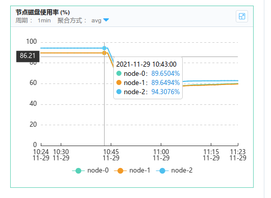
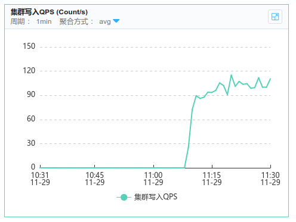

#### 一、问题描述

早间据研发反馈测试环境无最新日志，遂跟踪定位。

#### 二、解决步骤

1）查看运行时日志，提示写入ES成功

2）查看ES监控，写入QPS为0

3）查看ES日志，发现磁盘满载

```verilog
2021-11-29 10:42:50 [INFO ][o.e.c.m.MetaDataCreateIndexService] [node-0] [lop_edi_log_2021.11.30] creating index, cause [api], templates [temp_lop_edi_log], shards [18]/[1], mappings [doc]
2021-11-29 10:43:25 [WARN ][o.e.c.r.a.DiskThresholdMonitor] [node-0] high disk watermark [90%] exceeded on [twBRMm_FRmWHk7k38LPg2Q][node-2][/es_home/remote_storage/data/nodes/0] free: 22.7gb[5.6%], shards will be relocated away from this node
2021-11-29 10:43:25 [INFO ][o.e.c.r.a.DiskThresholdMonitor] [node-0] low disk watermark [85%] exceeded on [0am0KQmaQDmIAoZ4HdXAjQ][node-0][/es_home/remote_storage/data/nodes/0] free: 41.3gb[10.3%], replicas will not be assigned to this node
2021-11-29 10:43:25 [INFO ][o.e.c.r.a.DiskThresholdMonitor] [node-0] low disk watermark [85%] exceeded on [TskuSxM_Tl-_HSgAGslubA][node-1][/es_home/remote_storage/data/nodes/0] free: 41.3gb[10.3%], replicas will not be assigned to this node
2021-11-29 10:43:50 [INFO ][o.e.c.r.a.DiskThresholdMonitor] [node-0] low disk watermark [85%] exceeded on [0am0KQmaQDmIAoZ4HdXAjQ][node-0][/es_home/remote_storage/data/nodes/0] free: 41.3gb[10.3%], replicas will not be assigned to this node
2021-11-29 10:43:50 [WARN ][o.e.c.r.a.DiskThresholdMonitor] [node-0] high disk watermark [90%] exceeded on [twBRMm_FRmWHk7k38LPg2Q][node-2][/es_home/remote_storage/data/nodes/0] free: 22.7gb[5.6%], shards will be relocated away from this node
2021-11-29 10:43:50 [INFO ][o.e.c.r.a.DiskThresholdMonitor] [node-0] low disk watermark [85%] exceeded on [TskuSxM_Tl-_HSgAGslubA][node-1][/es_home/remote_storage/data/nodes/0] free: 41.3gb[10.3%], replicas will not be assigned to this node
2021-11-29 10:43:50 [INFO ][o.e.c.r.a.DiskThresholdMonitor] [node-0] rerouting shards: [high disk watermark exceeded on one or more nodes]
```

4）删除索引，观察磁盘使用情况



5）查看写入QPS仍为0。

6）此时同事通过另一个应用发现了写入ES异常

```verilog
2021-11-29 10:54:39[ elasticsearch[_client_][listener][T#1]:40318 ] - [ERROR] com.xx.xx.log.collector.es.client.impl.EsTransportClient-afterBulk:198 - 插入ES失   
败，ES Index:ClusterBlockException[blocked by: [FORBIDDEN/12/index read-only / allow delete (api)];],错误消息:{}
```

7）根据异常信息，查询解决方案

https://discuss.elastic.co/t/forbidden-12-index-read-only-allow-delete-api/110282/4

```bash
$ PUT .kibana/_settings
{
  "index": {
    "blocks": {
      "read_only_allow_delete": "false"
    }
  }
}

$ PUT _settings
{
  "index": {
    "blocks": {
      "read_only_allow_delete": "false"
    }
  }
}


$ PUT [current_write_index]/_settings
{
  "index": {
    "blocks": {
      "read_only_allow_delete": "false"
    }
  }
}
```

8）执行后，ES写入恢复。



#### 三、经验结论

1）由于第一个应用的ES是异步批量写入，第一次查看日志返回的成功只是代表`提交成功`，并不代表`写入成功`，此处日志有误导性。

2）ES磁盘使用高时，会拒绝写，此时需要根据每日最大写入量来评估索引保存天数