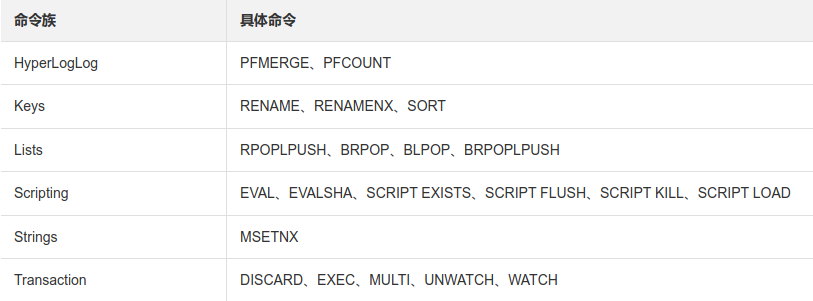

## 一、Redis数据结构

### 1、String

1）常用使用场景

计数器，分布式自增ID

### 2、Hash

谨慎出现大Key，导致性能下降和负载不均衡

1）使用场景

分布式锁

### 3、List

1）实现常见数据结构

I、实现栈：LPUSH + LPOP

II、实现队列：LPUSH + RPOP

III、实现阻塞队列：LPUSH + BRPOP

2）[LRange](https://www.runoob.com/redis/lists-lrange.html)

LRange可使用负坐标，-1代表最后一个元素。

3）常见使用场景

实现发布订阅，如微博等，pull + push

### 4、Set

1）常见使用场景

I、随机取值。如随机抽奖，`srandemember key count`, `spop key count`

II、去重后统计数量。如统计uniq元素

III、检查元素是否包含。如实现朋友圈我是否点赞，我关注的人也关注他

IV、方便的集合操作，并集，交集，差集。如实现好友共同关注（交集），我可能认识的人（差集）

### 5、ZSet

1）常用使用场景

有序集合，可实现排名场景，延迟队列

2）skipList

### TODO 补充底层存储结构

## 二、Redis是单线程吗？

1、是单线程吗？

Redis接收网络请求，执行是单线程。

Redis持久化，异步删除，同步是其他线程。

2、为什么选择单线程？

> It's not very frequent that CPU becomes your bottleneck with Redis, as usually Redis is either memory or network bound. For instance, using pipelining Redis running on an average Linux system can deliver even 1 million requests per second, so if your application mainly uses O(N) or O(log(N)) commands, it is hardly going to use too much CPU.

无论是否纯内存的DB，性能的瓶颈往往在IO，而非CPU。

## 三、Redis高性能原因

Redis单机能达到100W/S的原因：

1）C语言实现

2）采用IO多路复用技术接收和响应请求，减少网络开销

3）采用单线程处理请求，减少线程切换开销，减少线程并发开销

4）采用内存为运行时存储，无磁盘IO的限制

5）支持水平扩容，分布式均衡请求压力

## 四、Redis持久化

https://redis.io/topics/persistence

### 1、RDB-快照

1）快照机制

将数据库的内存的快照（snapshot）以二进制的方式保存到磁盘中，文件名dump.rdb

2）快照时机

I、自动触发：配置文件

```properties
# 可以配置多个save条件，当有一个符合条件即可触发执行bgsave。
save 60 1000 # 每60秒内至少1000个key发生变化时（增删改），则重写rdb
save 300 50
```

II、手动处罚：执行命令-**save/bgsave**

save：会阻塞主线程，直到快照生成完毕。生成快照期间，Redis无法处理客户端请求

bgsave：会fork出一个子进程，共享主进程的内存空间，由子进程负责执行快照生成，与此同时Redis可正常处理客户端请求。采用copy-on-write方式，主线程有修改时，对复制的副本做修改，子进程会负责把副本内容写入快照。

III、主从全量复制时生成快照

IV、执行shutdown命令生成快照

3）RDB优点

I、格式紧凑，适合于备份和恢复、进行灾备

II、性能好，把IO操作交给子进程，父进程无需介入

III、快速恢复，比AOF文件更快速的恢复

4）RDB缺点

I、数据损失多，时间点式备份策略可能会导致写操作结果丢失

II、需要经常fork子进程，如果数据集过大fork时间也会变长，影响客户端命令执行和响应。

### 2、AOF-Append only File

1）AOF机制

将写命令追加记录在appendonly.aof文件中（先写入os cache，然后根据配置的刷盘策略进行sync刷盘）。系统启动时会根据它恢复数据。当文件过大时redis会执行重写操作缩小体积。

2）配置文件开启AOF

```properties
# 开启AOF
appendonly yes
```

3）AOF落盘机制

AOF日志会先写入操作系统系统的内存缓冲区，当缓冲区满、超过指定时间、执行fsync命令时会进行落盘。

```properties
# 落盘策略
appendfsync always # 每条命令都刷盘
appendfsync everysec # 每秒刷盘一次，默认选择，兼顾安全和速度
appendfsync no # 交给操作系统
```

4）AOF重写配置

```
auto‐aof‐rewrite‐min‐size 
auto‐aof‐rewrite‐percentage
```

5）AOF优点

I、更灵活的持久化策略，可按需选择一致性和速度

II、追加方式，磁盘写入快，断电时不易产生写故障。可通过redis-check-aof命令进行检查和修复

III、格式容易解析和理解

6）AOF缺点

I、格式非紧凑，相同数据集备份比RDB大

II、根据具体策略，AOF可能比RDB更慢。RDB在处理大量写入时也能有不错的性能。

### 3、混合持久化

1）混合持久化机制

AOF在重写时，把重写时刻的当前数据内存做快照，然后把重写时刻之后的命令以AOF格式追加到快照上，重写完成后修改名称为appendonly.aof覆盖原有文件。

恢复时就可以先通过RDB进行快速恢复到某个时间点，然后重放AOF的命令日志。

2）配置文件开启混合持久化

```properties
aof‐use‐rdb‐preamble yes
```

## 五、Redis集群结构

参考[常见分布式中间件的共识协议](../21.分布式/2.常见分布式中间件的共识协议.md)

## 六、pipeline

1）客户端可批量发送请求，最后再读取服务端的响应。

2）客户端有buffer，buffer满时发送一次请求到服务端

3）服务端依次处理客户端发来的批量请求，然后把结果返回给客户端。

4）客户端发送完命令前不会读取缓冲区，缓冲区满后服务端不能再发送响应。

所以要避免发送大批量的命令集。

## 七、Lua脚本和事务

https://redis.io/topics/transactions

> A [Redis script](https://redis.io/commands/eval) is transactional by definition, so everything you can do with a Redis transaction, you can also do with a script, and usually the script will be both simpler and faster.

1、Lua脚本特性

1）减小网络开销

2）原子操作：**Redis会将整个脚本作为一个整体执行，中间不会被其他进程或者进程的命令插入**

3）脚本复用：客户端的脚本可上传至Server，其他客户端亦可使用。

4）替代Redis事务功能：原生事务不支持事务回滚，Lua脚本则支持报错回滚操作

2、脚本死循环

1）使用命令：script kill

2）原理：lua脚本引擎内置钩子函数，如脚本运行超时后会调用钩子函数检查kill标志位。

## 八、部分故障时是否提供服务

```
cluster-require-full-coverage yes # 部分master故障后，不再提供服务
cluster-require-full-coverage no # 部分master故障后，其他master仍能提供服务
```

##  九、Redis集群模式下命令限制

Redis集群模式下只有一个数据库（db0），其他模式有16个（db0-db15，不支持自主命名）可以通过select number来选择数据库。

1、集群模式下只有一个db0数据库，select命令无法使用。

2、Multi-Key操作受限，多Key需要在一个slot内。



3、Lua脚本同样只能操作一个slot内的数据。

使用hashTag，取Key内`{}`中内容进行散列，使需要操作的多个key落入同一个slot。不支持嵌套，使用时注意避免数据倾斜。

## # 参考

1. https://help.aliyun.com/document_detail/145968.html
2. https://www.cxymm.net/article/chushoufengli/110879106