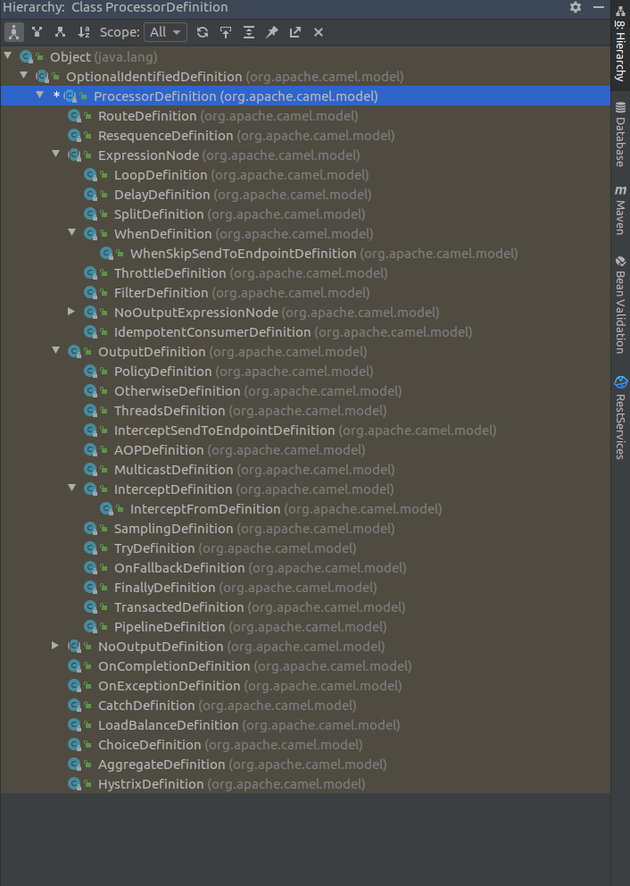

> 以下为我目前对流式编程的理解。
#### 一、 流式的好处
1. 更接近与自然语言；
2. 操作连贯，一行搞定（如Builder）;
#### 二、 设计原则
##### 1. Flunt Api在程序设计时，不能完全根据类的方法来限制其层级。
例如，Branch在自然语言上，其后面只能跟when和otherwise。但是程序设计时，出于Java语言的特性，类的继承等原因并不能完全限制，Branch类可能继承了父类的方法。
1）自然语言：

```
Branch  --> when / otherwise
```
2）编程语言：

```java
interface ContainerDefinition {
  LoopDefition loop();
  BranchDefinition branch();
  ...
}

class BranchDefinition extend ContainerDefinition {
  BranchDefinition when();
  BranchDefinition otherwise();
}
```
##### 2. 设计方法时注意方法的访问级别
1）public方法用于客户端流式API调用的接口，尽量贴近自然语言；
2）protect方法用于语句中可向子语句传递的内部方法，不会暴露给客户端；
3）private方法用于本语句的逻辑实现，不会被其他任何语句调用；

#### 三、设计方法
##### 1. 找出同级别语句，整理为结构图；如下为EDI的数据转化的Flunt Api设计：

```
Dt Root
|
|___Loop
|      |___Break
|
|___Branch
|       |___When
|       |___Otherwise
|
|___Try
        |___Catch
        |___Exception
```
##### 2. 根据级别分组，不同分组是隔离的；
1）第一层分组：

```
Loop,Branch,Try
```
2）第二层分组
```
1)Break;
2)when,otherwise
3)catch,exception
```
##### 3. 分析第一层分组的语句，他们之间是可以任意顺序连接的，故设计根类的方法如下：

```
class DtRoot {
  LoopDefinition loop();
  BranchDefinition branch();
  TryDefinition try();
  DtRoot end();
}
```
##### 4. 分析第二层分组，其隶属于第一层分组的某个语句，称为父语句；
父语句的方法有两种设计，如下：
1）返回第一层的语句；

```java
class Branch {
  Branch when(String expr)；
  ExpressionClause<Branch> when();
  Branch otherwise();
}

class ExpressionClause<T> {
   T expression(Expression expr);
}
```
2）返回第二层语句；
```java
class BranchDefinition extend ContainerDefinition {
  WhenDefinition when(String expr);
  OtherwiseDefinition otherwise();
}
```
#### 四、EDI的实现
###### 1. 限定流程的Core，第三方只能扩展Processor（目前Processor含set,attr,validator等processor）。
###### 2. 非完全意义上的流式实现，去掉了end这类返回父语句的操作，如下所示：
1）正常流式

```java
branch.when(expr).process(processorA).otherwise().process(processorB).endbranch()
```
2）edi实现
```java
branch.when(expr).process(processorA);
branch.otherwise().process(processorB);
```
#### 五、附录
