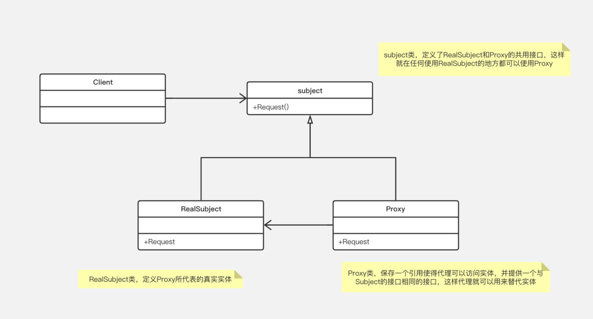
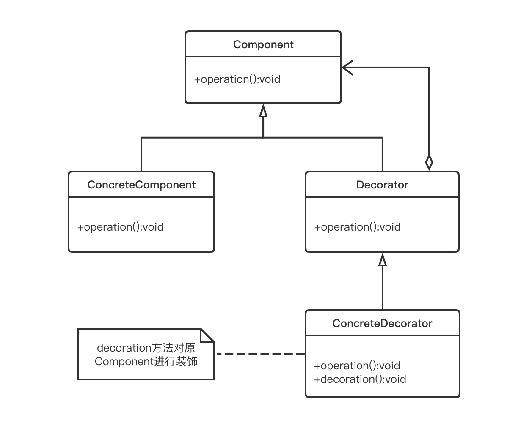

#### 1. 相同点

类图相似：

#### 2. 不同点

1. 功能
     * 装饰器用于增强新的功能，如java的Stream设计，实现拦截器，职责链等；
     * 代理用于限制或改变功能，如延迟实例化，AOP等；
2. 关联实例的时间
     * 装饰器的实例可在运行时动态传入；
     * 代理的实例一般编译时确定；
3. 客户端使用
     * 装饰器，客户端在使用时可以自由组合，具有主动性；
     * 代理，客户端一般处于被动，无法改变代理的逻辑；

#### 参考：

1. [https://stackoverflow.com/questions/350404/how-do-the-proxy-decorator-adapter-and-bridge-patterns-differ](https://stackoverflow.com/questions/350404/how-do-the-proxy-decorator-adapter-and-bridge-patterns-differ)