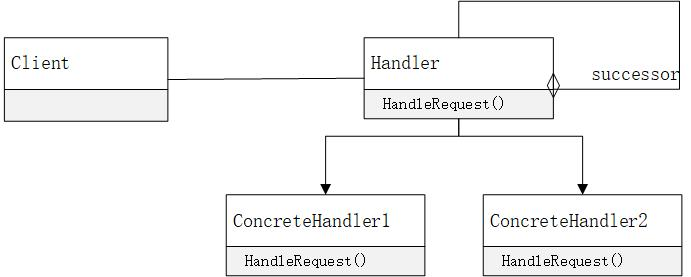
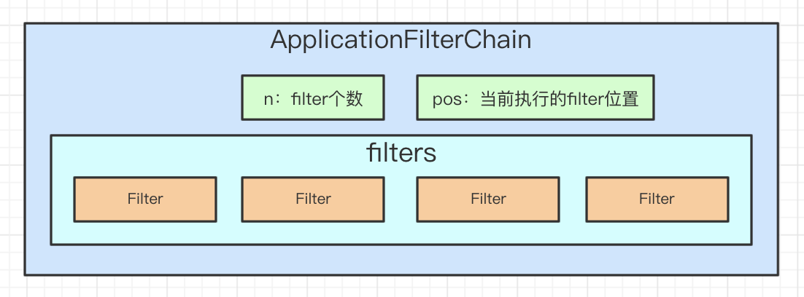
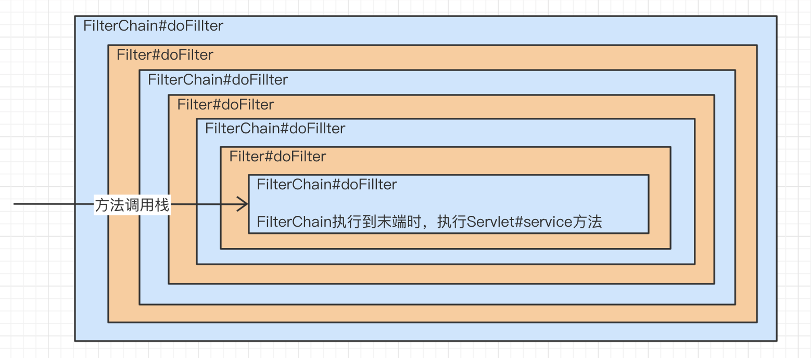
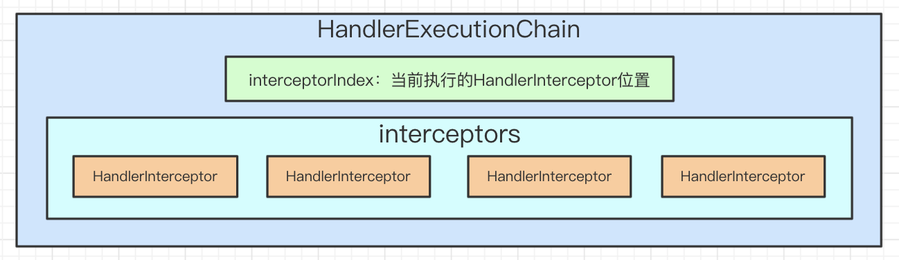
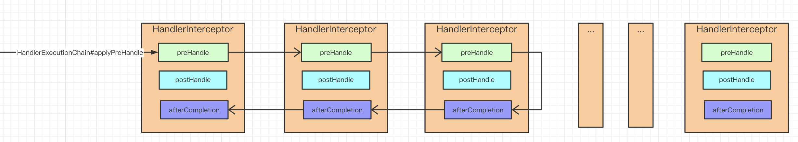
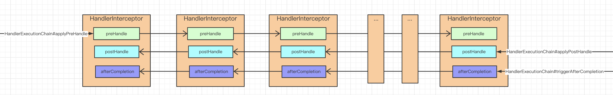

#### 一、责任链模式

责任链模式，抽象出处理器接口Handler，系统运行时会依据某种顺序把这些Handler的实现类组成调用链。客户的请求会依次经过这些处理器，直到执行完整条链或者其中的某个处理器不再向后继续调用。

1）其好处主要有：

* 把一系列处理逻辑进行分离，减少耦合。

* 因为抽象出了Handler接口，更利于扩展，可方便的增加新的处理器。

2）在构建调用链时通常有两种方式：

* 组合成List<Handler>。

* Handler内持有下一个Handler引用。

3）同样的在调用责任链时也有两种方式：

* 栈式递归调用，如servlet的Filter。

* 非栈式串行调用，如spring框架的Interceptor。



#### 二、Filter实现方式

##### 1）Filter接口

```java
package javax.servlet;

public interface Filter {
    public void init(FilterConfig filterConfig) throws ServletException;

    public void doFilter(ServletRequest request, ServletResponse response,
            FilterChain chain) throws IOException, ServletException;

    public void destroy();
}
```

##### 2）构建和调用Filter链源码

位置：org.apache.catalina.core.StandardWrapperValve#invoke

```java
import java.io.IOException;ppackage org.apache.catalina.core;

final class StandardWrapperValve extends ValveBase {
    @Override
    public final void invoke(Request request, Response response) throws IOException, ServletException {
        // 忽略其他逻辑

        // 构建FilterChain
        ApplicationFilterChain filterChain = ApplicationFilterFactory.createFilterChain(request, wrapper, servlet);
        try {
            if ((servlet != null) && (filterChain != null)) {
                if (context.getSwallowOutput()) {
                    try {
                        SystemLogHandler.startCapture();
                        if (request.isAsyncDispatching()) {
                            request.getAsyncContextInternal().doInternalDispatch();
                        } else {
                            // 执行FilterChain
                            filterChain.doFilter(request.getRequest(), response.getResponse());
                        }
                    } finally { // 忽略日志逻辑
                    }
                } else {
                    if (request.isAsyncDispatching()) {
                        request.getAsyncContextInternal().doInternalDispatch();
                    } else {
                        // 执行FilterChain
                        filterChain.doFilter(request.getRequest(), response.getResponse());
                    }
                }
            }
        } catch (Exception e) { // 忽略异常逻辑
        }
    }
}
```

##### 3）ApplicationFilterChain源码

```java
package org.apache.catalina.core;

import java.io.IOException;
import java.security.PrivilegedActionException;

public final class ApplicationFilterChain implements FilterChain {
    /**
     * Filters， ApplicationFilterConfig是Filter的封装类
     */
    private ApplicationFilterConfig[] filters = new ApplicationFilterConfig[0];
    /**
     * 当前要执行的Filter下标位置
     */
    private int pos = 0;
    /**
     * filter的size
     */
    private int n = 0;

    public void doFilter(ServletRequest request, ServletResponse response) throws IOException, ServletException {
        if (Globals.IS_SECURITY_ENABLED) {
            final ServletRequest req = request;
            final ServletResponse res = response;
            try {
                java.security.AccessController.doPrivileged(
                        new java.security.PrivilegedExceptionAction<Void>() {
                            @Override
                            public Void run() throws ServletException, IOException {
                                internalDoFilter(req, res);
                                return null;
                            }
                        }
                );
            } catch (PrivilegedActionException pe) { // 忽略异常逻辑
            }
        } else {
            internalDoFilter(request, response);
        }
    }

    private void internalDoFilter(ServletRequest request, ServletResponse response) throws IOException,
            ServletException {
        // 执行FilterChain
        // Call the next filter if there is one
        if (pos < n) {
            // 1. 从FilterChain中获取下一个Filter
            ApplicationFilterConfig filterConfig = filters[pos++];
            try {
                Filter filter = filterConfig.getFilter();

                if (request.isAsyncSupported() && "false".equalsIgnoreCase(
                        filterConfig.getFilterDef().getAsyncSupported())) {
                    request.setAttribute(Globals.ASYNC_SUPPORTED_ATTR, Boolean.FALSE);
                }
                if (Globals.IS_SECURITY_ENABLED) {
                    final ServletRequest req = request;
                    final ServletResponse res = response;
                    Principal principal = ((HttpServletRequest) req).getUserPrincipal();

                    Object[] args = new Object[]{req, res, this};
                    SecurityUtil.doAsPrivilege("doFilter", filter, classType, args, principal);
                } else {
                    // 2. 调用Filter
                    filter.doFilter(request, response, this);
                }
            } catch (Throwable e) { // 忽略异常逻辑
            }
            return;
        }

        // FilterChain执行到末端后，调用servlet示例真正处理请求
        // We fell off the end of the chain -- call the servlet instance
        try {
            if (ApplicationDispatcher.WRAP_SAME_OBJECT) {
                lastServicedRequest.set(request);
                lastServicedResponse.set(response);
            }
            if (request.isAsyncSupported() && !servletSupportsAsync) {
                request.setAttribute(Globals.ASYNC_SUPPORTED_ATTR, Boolean.FALSE);
            }
            // Use potentially wrapped request from this point
            if ((request instanceof HttpServletRequest) && (response instanceof HttpServletResponse) && Globals.IS_SECURITY_ENABLED) {
                final ServletRequest req = request;
                final ServletResponse res = response;
                Principal principal = ((HttpServletRequest) req).getUserPrincipal();
                Object[] args = new Object[]{req, res};
                SecurityUtil.doAsPrivilege("service", servlet, classTypeUsedInService, args, principal);
            } else {
                servlet.service(request, response);
            }
        } catch (Throwable e) { // 忽略异常逻辑
        } finally {
            if (ApplicationDispatcher.WRAP_SAME_OBJECT) {
                lastServicedRequest.set(null);
                lastServicedResponse.set(null);
            }
        }
    }
}
```

##### 4）FilterChain的图解

由以上源码逻辑可知其采用栈式递归调用方式来执行FilterChain。

FilterChain结构如下图：



FilterChain执行时方法调用栈如下图：



#### 三、HandlerInterceptor实现方式

##### 1）HandlerInterceptor接口

```java
package org.springframework.web.servlet;

public interface HandlerInterceptor {
    boolean preHandle(HttpServletRequest var1, HttpServletResponse var2, Object var3) throws Exception;

    void postHandle(HttpServletRequest var1, HttpServletResponse var2, Object var3, ModelAndView var4) throws Exception;

    void afterCompletion(HttpServletRequest var1, HttpServletResponse var2, Object var3, Exception var4) throws Exception;
}
```

##### 2）HandlerInterceptor调用时机

```java
package org.springframework.web.servlet;

public class DispatcherServlet extends FrameworkServlet {
    protected void doDispatch(HttpServletRequest request, HttpServletResponse response) throws Exception {
        HttpServletRequest processedRequest = request;
        HandlerExecutionChain mappedHandler = null;
        boolean multipartRequestParsed = false;
        WebAsyncManager asyncManager = WebAsyncUtils.getAsyncManager(request);
        try {
            ModelAndView mv = null;  Exception dispatchException = null;
            try {
                // Determine handler adapter for the current request.
                HandlerAdapter ha = getHandlerAdapter(mappedHandler.getHandler());

                // 1. 执行HandlerInterceptor链的preHandler逻辑
                if (!mappedHandler.applyPreHandle(processedRequest, response)) {
                    // 如果拦截成功，HandlerExecutionChain内部会调用HandlerInterceptor#afterCompletion逻辑
                    return;
                }

                // 2. 真正调用Handler
                // Actually invoke the handler.
                mv = ha.handle(processedRequest, response, mappedHandler.getHandler());
                applyDefaultViewName(processedRequest, mv);

                // 3. 执行HandlerInterceptor链的postHandle逻辑
                mappedHandler.applyPostHandle(processedRequest, response, mv);
            } catch (Throwable err) {
            }
            // 4.1 执行HandlerInterceptor链的afterCompletion逻辑
            processDispatchResult(processedRequest, response, mappedHandler, mv, dispatchException);
        } catch (Throwable err) {
            // 4.2 捕获processDispatchResult的异常，保证执行到HandlerInterceptor链的afterCompletion逻辑
            triggerAfterCompletion(processedRequest, response, mappedHandler, ex);
        } finally { // 忽略
        }
    }
}
```

##### 3）HandlerExecutionChain源码解析

```java
package org.springframework.web.servlet;

public class HandlerExecutionChain {
    private HandlerInterceptor[] interceptors;
    private List<HandlerInterceptor> interceptorList;
    private int interceptorIndex = -1;

    public HandlerInterceptor[] getInterceptors() {
        if (this.interceptors == null && this.interceptorList != null) {
            this.interceptors = this.interceptorList.toArray(new HandlerInterceptor[this.interceptorList.size()]);
        }
        return this.interceptors;
    }

    // 遍历interceptors,（正序）依次调用HandlerInterceptor#preHandle
    boolean applyPreHandle(HttpServletRequest request, HttpServletResponse response) throws Exception {
        HandlerInterceptor[] interceptors = getInterceptors();
        if (!ObjectUtils.isEmpty(interceptors)) {
            for (int i = 0; i < interceptors.length; i++) {
                HandlerInterceptor interceptor = interceptors[i];
                if (!interceptor.preHandle(request, response, this.handler)) {
                    // 如果拦截成功，则触发HandlerInterceptor的afterCompletion逻辑
                    triggerAfterCompletion(request, response, null);
                    return false;
                }
                this.interceptorIndex = i;
            }
        }
        return true;
    }

    // 遍历interceptors,（倒序）依次调用HandlerInterceptor#postHandle
    void applyPostHandle(HttpServletRequest request, HttpServletResponse response, ModelAndView mv) throws Exception {
        HandlerInterceptor[] interceptors = getInterceptors();
        if (!ObjectUtils.isEmpty(interceptors)) {
            for (int i = interceptors.length - 1; i >= 0; i--) {
                HandlerInterceptor interceptor = interceptors[i];
                interceptor.postHandle(request, response, this.handler, mv);
            }
        }
    }

    // 遍历interceptors,从当前拦截器位置倒序调用HandlerInterceptor#afterCompletion
    void triggerAfterCompletion(HttpServletRequest request, HttpServletResponse response, Exception ex)
            throws Exception {
        HandlerInterceptor[] interceptors = getInterceptors();
        if (!ObjectUtils.isEmpty(interceptors)) {
            for (int i = this.interceptorIndex; i >= 0; i--) {
                HandlerInterceptor interceptor = interceptors[i];
                try {
                    interceptor.afterCompletion(request, response, this.handler, ex);
                } catch (Throwable ex2) {
                    logger.error("HandlerInterceptor.afterCompletion threw exception", ex2);
                }
            }
        }
    }
}
```

##### 4）HandlerExecutionChain图解

HandlerExecutionChain结构图：



HandlerExecutionChain调用时，有拦截器返回false时：



HandlerExecutionChain调用时，有拦截器无返回false时：



#### 四、两者调用方式分析

##### 1）通过方法栈递归调用

* 方法栈调用时，对异常处理较方便
* 如果责任链太长，可能导致StackOverflow
* 更容易实现事务功能
* 每个处理器都需持有下一个处理器引用或者责任链引用

##### 2）通过遍历列表依次调用

* 异常处理逻辑较复杂
* 责任链长度无特殊限制
* 每个处理器无需持有下一个处理器引用或者责任链引用

#### # 参考

1. https://zhuanlan.zhihu.com/p/146435548
2. https://baike.baidu.com/item/%E8%B4%A3%E4%BB%BB%E9%93%BE%E6%A8%A1%E5%BC%8F/5295498?fr=aladdin