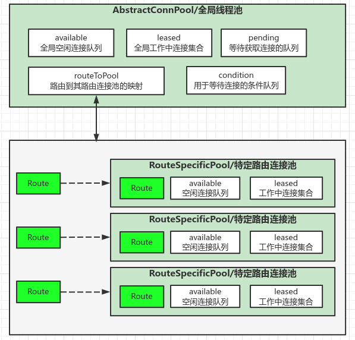

> 源码：httpcomponents-core-4.4.13，org.apache.http.pool.AbstractConnPool

## 一、源码+注释

```java
public abstract class AbstractConnPool<T, C, E extends PoolEntry<T, C>>
                                               implements ConnPool<T, E>, ConnPoolControl<T> {
    private E getPoolEntryBlocking(
            final T route, final Object state,
            final long timeout, final TimeUnit timeUnit,
            final Future<E> future) throws IOException, InterruptedException, ExecutionException, TimeoutException {
    	// 1. 根据connectionRequestTimeout计算等待终止时间
        Date deadline = null;
        if (timeout > 0) {
            deadline = new Date (System.currentTimeMillis() + timeUnit.toMillis(timeout));
        }
        this.lock.lock();
        try {
            // 2. 获取该路由的连接池，如果没有则新建
            final RouteSpecificPool<T, C, E> pool = getPool(route);
            E entry;
            // 3. 循环用来处理等待逻辑
            for (;;) {
                Asserts.check(!this.isShutDown, "Connection pool shut down");
                if (future.isCancelled()) {
                    throw new ExecutionException(operationAborted());
                }
                // 4. 尝试从该路由的连接池获取连接
                for (;;) {
                    // 若pool.available有可用连接，则移动至pool.leased并返回
                    entry = pool.getFree(state);
                    if (entry == null) {
                        break;
                    }
                    // entry若过期，设置为close
                    if (entry.isExpired(System.currentTimeMillis())) {
                        entry.close();
                    }
                    // entry若已close，则从全局可用队列this.available移除
                    if (entry.isClosed()) {
                        // 全局可用available移除
                        this.available.remove(entry);
                        // 从pool.leased移动至pool.available
                        pool.free(entry, false);
                    } else {
                        break;
                    }
                }
                // 5.1 若从该路由的连接池获取到连接，则从全局可用队列移动到待释放队列，然后返回
                // this.available ---> this.leased
                if (entry != null) {
                    this.available.remove(entry);
                    this.leased.add(entry);
                    onReuse(entry);
                    return entry;
                }

                // 5.2 若从该路由的连接池没获取到连接，则开始新建连接逻辑
                // 1）获取该路由允许使用连接的最大值
                final int maxPerRoute = getMax(route);
                // 2）计算该路由超出的连接数（由于最少需要释放一个，所以总数+1）
                final int excess = Math.max(0, pool.getAllocatedCount() + 1 - maxPerRoute);
                // 3）按LRU淘汰从该路由的pool.available移除空闲连接，同样在全局this.available里删除
                if (excess > 0) {
                    for (int i = 0; i < excess; i++) {
                        final E lastUsed = pool.getLastUsed();
                        if (lastUsed == null) {
                            break;
                        }
                        lastUsed.close();
                        this.available.remove(lastUsed);
                        pool.remove(lastUsed);
                    }
                }
                // 4.1）如果该路由当前已分配的连接小于设置的该路由的最大连接数，并且全局连接数未达到上限，为该路由创建新连接。然后返回。
                // 当前全局连接数大于上限时，则根据LRU原则从全局可用连接里淘汰连接（会从其路由里也删除）
                if (pool.getAllocatedCount() < maxPerRoute) {
                    final int totalUsed = this.leased.size();
                    final int freeCapacity = Math.max(this.maxTotal - totalUsed, 0);
                    if (freeCapacity > 0) {
                        final int totalAvailable = this.available.size();
                        if (totalAvailable > freeCapacity - 1) {
                            if (!this.available.isEmpty()) {
                                final E lastUsed = this.available.removeLast();
                                lastUsed.close();
                                final RouteSpecificPool<T, C, E> otherpool = getPool(lastUsed.getRoute());
                                otherpool.remove(lastUsed);
                            }
                        }
                        final C conn = this.connFactory.create(route);
                        entry = pool.add(conn);
                        this.leased.add(entry);
                        return entry;
                    }
                }
                // 4.2）加入连接等待队列，当有连接释放时，若等待队列不为空则会唤醒等待的线程，进入下次循环重新尝试获取连接。
                // 此处会根据设置的connectionRequestTimeout设置等待超时时间
                boolean success = false;
                try {
                    pool.queue(future);
                    this.pending.add(future);
                    if (deadline != null) {
                        success = this.condition.awaitUntil(deadline);
                    } else {
                        this.condition.await();
                        success = true;
                    }
                    if (future.isCancelled()) {
                        throw new ExecutionException(operationAborted());
                    }
                } finally {
                    pool.unqueue(future);
                    this.pending.remove(future);
                }
                if (!success && (deadline != null && deadline.getTime() <= System.currentTimeMillis())) {
                    break;
                }
            }
            throw new TimeoutException("Timeout waiting for connection");
        } finally {
            this.lock.unlock();
        }
    }
}
```

## 二、获取连接逻辑

1. 根据connectionRequestTimeout计算等待终止时间
2. 获取该路由的连接池，如果没有则新建
3. 循环用来处理等待逻辑
   1. 尝试从该路由的连接池获取连接
   2. 若从该路由的连接池获取到连接，则从全局可用队列移动到待释放队列，然后返回
   3. 若从该路由的连接池没获取到连接，则开始新建连接逻辑
      1. 获取该路由允许使用连接的最大值，计算该路由超出的连接数（由于最少需要释放一个，所以总数+1）
      2. 按LRU淘汰从该路由的pool.available移除空闲连接，同样在全局this.available里删除
      3. 如果该路由当前已分配的连接小于设置的该路由的最大连接数，并且全局连接数未达到上限，为该路由创建新连接，然后返回（当前全局连接数大于上限时，则根据LRU原则从全局可用连接里淘汰连接，会从其对应路由里也删除）
      4. 加入连接等待队列，当有连接释放时，若等待队列不为空则会唤醒等待的线程，进入下次循环重新获取连接（此处会根据设置的connectionRequestTimeout设置等待超时时间）

## 三、结构图

