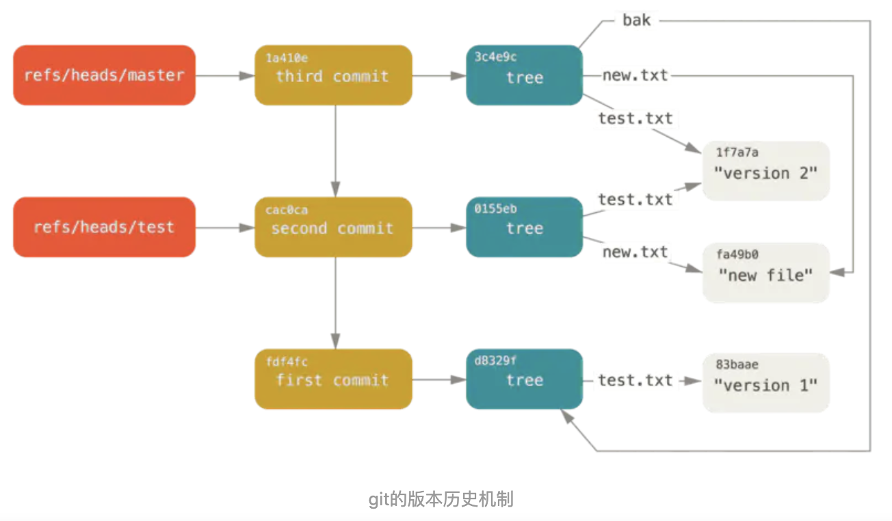
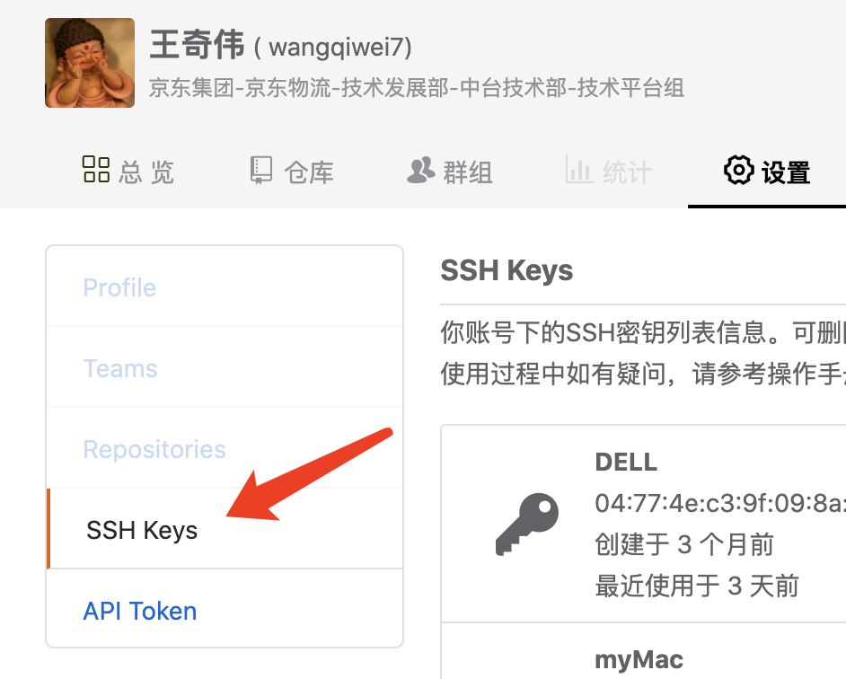
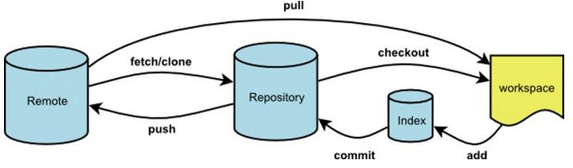
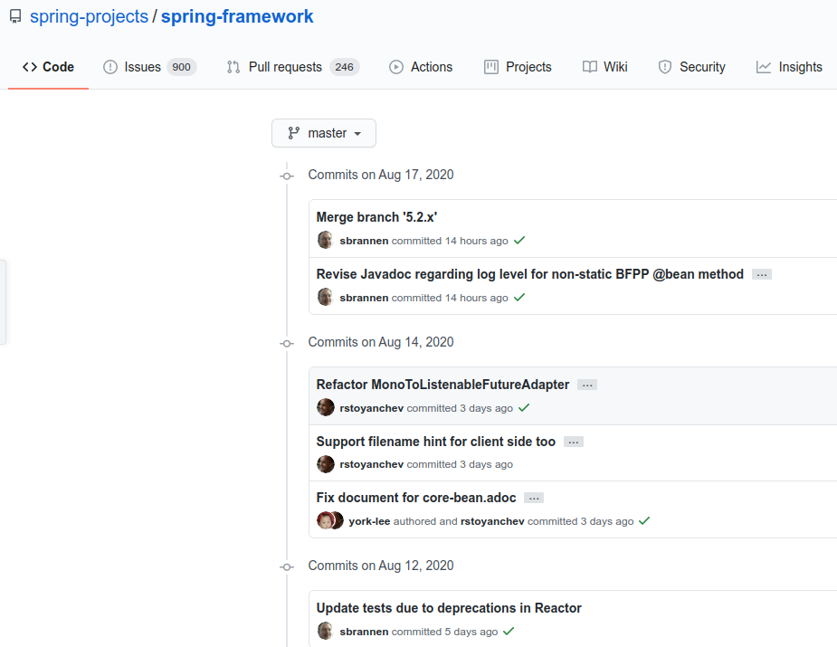

# Git原理及应用

> Author： 王奇伟
>
> Date：2020/08/19

#### 零、EDI应用


#### 一、 Git原理

##### 1. VCS对比

###### 1）没有VCS


###### 2）本地版本控制


1. 机制：通过数据库记录文件历次更新的差异，差异以补丁的形式记录对应文件修订前后的内容变化。
2. 不足：不支持多开发者协同工作。
3. 典型软件：rcs

###### 3）集中版本控制


1. 机制：单一的集中管理的服务器保存所有文件的修订版本，协同工作的人们通过客户端连到该服务器，取出最新的文件或提交更新
2. 不足：中央服务器的单点故障可能导致数据丢失。
3. 典型软件：CVS，Subversion，Perforce等。

###### 4）分布式版本控制


1. 机制：每个客户端都拥有独立且完整的版本仓库，且客户端地位相等（类似P2P网络），它们之间可相互获取、推送更新。
2. 优点：1）消除集中版本控制系统的单点故障；2）协作开发时，允许单个客户端在本地版本仓库独立提交更新，并在合适时推送给其他客户端或某个约定为中央仓库的客户端。
3. 典型软件：Git，Mercurial，Bazaar，Darcs等。

##### 2. Git的特性

###### 1）保存快照，而非差异

1. Git关心文件整体内容的变化，而大多数其他系统则关心文件内容的差异（svn基于增量）。
2. 此特性为多分支并行开发提供了支持。


###### 2）几乎所有操作都是本地操作
1. 速度快
2. 客户端离线时也可进行更新操作

###### 3）时刻保持数据完整性
1. 保存到Git之前，所有数据都要经过Hash运算，并将Hash值作为数据的唯一标识和索引，而非文件名。
2. Git采用[SHA-1](https://baike.baidu.com/item/SHA-1/1699692?fr=aladdin)算法来生成文件或整个目录的杂凑值，并作为唯一标识。该算法输出160bit哈希值，即40个16进制字符（0-9及a-f）。类似`24b9da6552252987aa493b52f8696cd6d3b00373`。

##### 3. Git目录结构

.git/包含了以下目录和文件：

- ~~branches/：新版本不再使用~~
- description：仅供GitWeb程序使用
- config：当前项目的配置选项

```properties
[core]
        repositoryformatversion = 0
        filemode = true
        bare = false
        logallrefupdates = true
        ignorecase = true
        precomposeunicode = true
[remote "origin"]
        url = git@github.com:kivihub/java-fragment.git
        fetch = +refs/heads/*:refs/remotes/origin/*
[branch "dev"]
        remote = origin
        merge = refs/heads/dev
```

- info/exclude：不同于.gitignore文件，可配置本地的文件忽略模式，不会push到remote库而影响其他人。

- hooks/：目录存放钩子脚本，如校验commit msg，git-lfs

- objects/：目录存储所有数据内容，可细分为四大对象blob，tree，commit，tag

- refs/：目录存储指向数据的commit对象的指针

  

- HEAD：文件内容为当前分支

```
ref: refs/heads/dev
```

- index：文件内容为暂存区的信息

##### 4. 工作区，暂存区和仓库的概念


##### 5. 高级命令和低级命令

1. 用户平时使用的Git命令一般为高层命令，如add、commit、checkout等；高层命令对用户友好，便于理解和操作。
2. Git起初被设计为供VCS使用的工具集，这些工具也称为底层命令；底层命令一般不被用户直接使用，而是被shell或脚本调用。如cat-file

##### 6. Git的四大对象：blob，tree，commit，tag





```git
vim .git/refs/heads/dev

// 文件内容
b8942bbf8ff41d8670611a7c256e5663d973e28b
```


##### 7. 基于内容存储和Hash碰撞

1. 依赖底层命令`git hash-object`命令，对文件内容增加头信息后计算hash值并返回，增加`-w`参数后在git仓库内创建blob对象（**blob对象 = 对象头 + 文件内容**）。
2. blob对象存储到git仓库目录（.git/objects/）时，依据40位（16进制字符）长度的hash串指定存储目录（hash串前2位）和命名文件（hash串后38位）。例如某blob对象的hash值为`62/0d4582bfbf773ef15f9b52ac434906a3cdf9c3`，那么它在git仓库中的路径为`.git/objects/62/0d4582bfbf773ef15f9b52ac434906a3cdf9c3`，blob对象采用zlib方式压缩后存储。
3. Git内容寻址本质是：Git根据由文件内容（增加文件头）产生的Hash值来标识和索引文件。另外进行命令操作时没有必要写完整的hash串，只要输入的hash串长度是唯一可识别和索引的即可。

```java
public class GitBlobSha1Util {
    public static String digest(File file) throws IOException {
        return digest((InputStream)(new FileInputStream(file)));
    }

    public static String digest(InputStream in) throws IOException {
        byte[] content = IOUtils.toByteArray(in);
        return digest(content);
    }

    public static String digest(byte[] content) {
        byte[] header = ("blob " + content.length + "\u0000").getBytes();
        byte[] sum = new byte[header.length + content.length];
        System.arraycopy(header, 0, sum, 0, header.length);
        System.arraycopy(content, 0, sum, header.length, content.length);
        return DigestUtils.sha1Hex(sum);
    }
}
```

4. Hash碰撞

1）当出现冲突时，保留当前仓库已有的对象

2）冲突场景


3）解决方式

* commit冲突时，再次提交即可，其中包含时间戳；
* tree和blob冲突时，修改下文件内容即可，如增加空格，空行等；

##### 8.三路合并（**3-way merge**）


##### 9. Merge策略概览

1）**resolve**：用于合并两个分支（git merge branchA branchB），合并算法：三方合并。

2）**recursive**（默认合并策略）：用于合并两个分支（git merge branchA branchB），合并算法：三方合并。

当有多个共同祖先可用于三向合并时，它会创建一个共同祖先的合并树，并将其用作三向合并的参考树。


3）**octopus**：用于合并多个分支；

4）**ours**：不限合并分支数量，但遇见冲突时始终使用自己的修改，忽略其他分支的修改；

5）**subtree**：改进的recursive算法，考虑子树的匹配；

##### 10. Diff算法概览

1）MyersDiff（默认算法）：Eugene W. Myers 在他1986年发表于"Algorithmica"的论文"An O(ND) Difference Algorithm and Its Variations"中描述了一种用于处理diff的基础贪婪算法. [论文连接]( https://wenku.baidu.com/view/94453717866fb84ae45c8d34.html)

寻找两个文件的最长公共子序列可转为一个同构问题：有向编辑图

* x轴走一步：删除一个字符

* y轴走一步：增加一个字符

* 对角线走一步：无需编辑


1. 初始状态：abcabba
2. x轴2步：cabba
3. 对角线一步：c abba
4. y轴1步：cb abba
5. 对角线2步：cbab ba
6. x轴1步：cbab a
7. 对角线1步：cbaba
8. y轴1步：`cbabac`

2）HistogramDiff

##### 11. 配置SSH登陆

1）减少密码过期带来的困扰

2）多平台认证更方便：git.jd.com,coding.jd.com,github.com




##### 12. 配置sparse checkout

1）配置.git/config，core下增加`sparsecheckout = true`

2）配置.git/info/sparse-checkout

#### 二、 Git命令一览

##### 1. 常用命令及参数

```shell
git status		// 查看当前Git状态
git log				// 查看日志
git checkout	// 可用于1）检出分支；2）创建分支；3）检出文件；4）暂存区覆盖工作区；
git stash			// 暂存工作区
git pull			// 拉取远程分支并合并，等效于：git fetch + git merge
git push			// 1）push内容到远程，2）删除分支，git push origin :dev
git revert		// 生成撤销提交
git reset			// 恢复工作区，暂存区，仓库到指定revision
git rebase		// 变基
git cherry-pick	// 挑拣
git blame			// 查看文件中每行的提交信息
git diff			
git show			// 查看提交信息等
git branch		
git fiter-branch
```





##### 2. 特殊符号

1）引用符号


2）提交范围

| **类别** | **表示**       | **作用**                                | 数学概念                                |
| -------- | -------------- | --------------------------------------- | --------------------------------------- |
| 两点提交 | before..after  | 隶属于after分支，但不隶属于before的提交 | 差集 (after-before)                     |
| 三点提交 | before...after | 两分支中除去共同拥有的提交外的提交      | 并集-交集 (before∪after - before∩after) |
| 取非     | ^或--not       | 不包含指定分支的所有提交                | 差集                                    |

##### 3. 使用场景

###### 1）恢复到指定版本

```
// 事例：dev分支恢复到历史revision
git reset --hard revision
git reset --soft origin/dev
git commit
```

###### 2）合并提交/拆分提交

```
git rebase -i revision
```

###### 3）删除误提交的大文件

```
git filter-branch
```

###### 4）暂存当前工作区

```
git stash --all
git stash pop/apply --index
```

###### 5）用其他分支的文件覆盖当前文件

```
git chekout otherbranch path
```

#### 三、 Git规范

##### 1. 提交流程规范

```git
git commit
git pull
git push
```


##### 2. 提交信息规范

```git
<type>: <subject>	// 类型及摘要：type由团队内部协定：如feature，refactor，fixbug等
<BLANK LINE>		// 空行
<detail body>		// 详细信息
</detail body>
```



##### 3. 提交粒度

粒度：一个工作一个提交

优势：利于code review和回滚

##### 4. pull merge vs pull rebase

```shell
git pull = git fetch + git merge
git pull --rebase = git fetch + git rebase
```


优劣：

1）rebase：提交历史呈线性，较merge整洁，便于代码review；

2）merge：保存原始提交历史；

##### 5. 分支命名规范

```shell
feature/log -- 特性分支
refactor/http -- 重构分支
hotfix/fastjson -- fixbug分支
wangqiwei -- 本地分支/临时分支
```

##### 6. cherry-pick后小心revert

如以下情况会出现非预期结果


#### 四、 Git工作流

三大工作流：

##### 1. TBD：Trunk-based development

1）特点：

* TBD的特点是所有团队成员都在单个主干分支上进行开发。
* 简单易操作，减少分支切换，流行于SVN（svn trunck = git master）

2）流程：

* 当需要发布时，先考虑使用标签（`tag`）,即`tag`某个`commit`来作为发布的版本。
* 如果仅仅依靠`tag`不能满足要求，则从主干分支创建发布分支。
* `bug`修复在主干分支进行，再`cherry-pick`到发布分支


##### 2. [Git Flow](https://nvie.com/posts/a-successful-git-branching-model/)

1）适合场景

* 适合维护多个发布版本
* 流程较其他工作流复杂

2）分支描述

* 长期分支

  * develop：开发分支，稳定后可并入master；
  * master：HEAD总处于可发布态；每个版本对应一个tag；

* 辅助分支

  * feature

    * 通常是本地分支，合并回develop后删除；
    * may from `develop`
    * must merge back to `develop`
      * (develop)：git merge --no-ff，体现出特性

  * release

    * 合并回master和develop后删除；
    * may from `develop`
    * must merge back to `develop` and `master`
      * (master)：git merge --no-ff，体现出特性
      * (devlop)：git merge --no-ff，体现出特性
    * 迁出分支后，首先修改为新版本号；

  * hotfix

    * May from master
    * Must merge back to `develop` and `master`
      * (master)：git merge --no-ff，体现出特性
      * (devlop)：git merge --no-ff，体现出特性（当release分支存在时优先合并进release分支，由release分支合并进develop）
    * 迁出分支后，首先修改为新版本号；

    


##### 3. GitHub Flow

1）特点：

* 简单实用

2）流程

* `master`分支中也是代表着稳定的代码。该分支已经或即将被部署在生产环境
* 当需要进行任何修改时，总是从`master`分支创建新分支。完成之后通过`pull request`和相关的代码审查来合并回`master`分支
* hotfix, feature分支都遵循上面的准则；


##### 4. 对比

来源：https://mp.weixin.qq.com/s/9Ey04P5Xv4W95N2FEioZ1g


